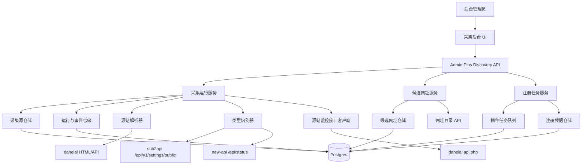
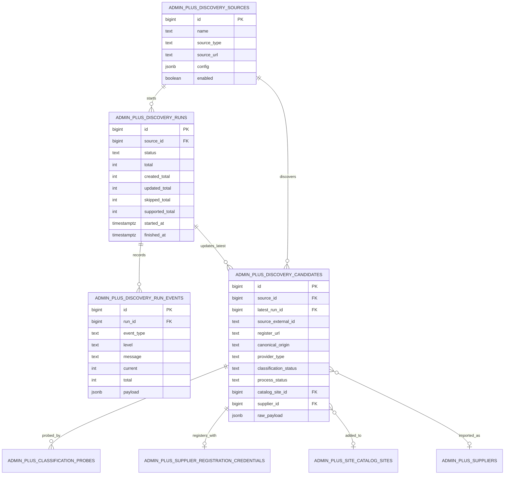
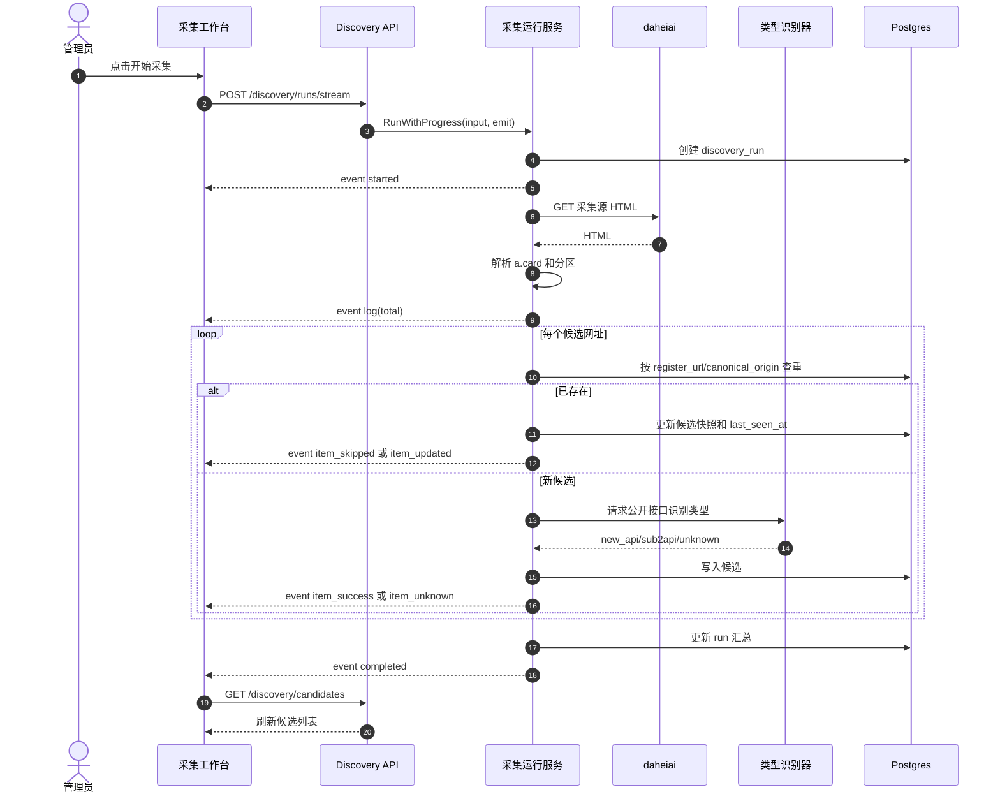
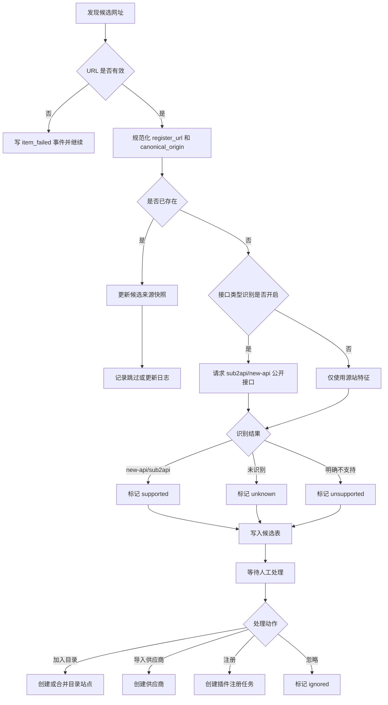
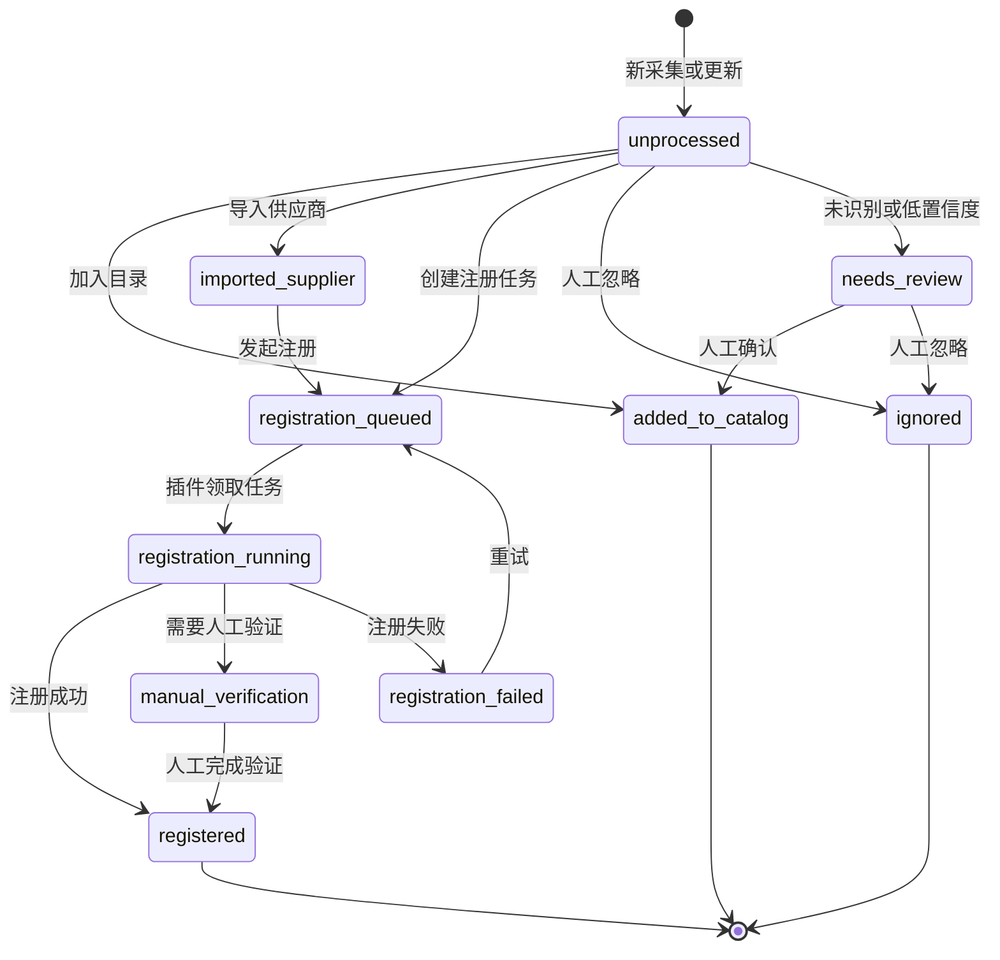

# 渠道索引采集后台 PRD

版本：v0.1.0
日期：2026-06-24
状态：方案设计
范围：后台采集源管理、采集运行、候选网址解析、new-api/sub2api 分类、进度日志、候选入库、注册任务联动，以及加入网址目录的数据流。

## 1. 背景

当前 `渠道索引采集` 页面已经能从 `https://api.daheiai.com/` 抓取部分第三方中转网址，并尝试识别 `new-api` 与 `sub2api`。但它仍然更像一个临时采集工具，存在几个问题：

- 采集结果和未来前台网址导航的主数据边界不清晰。
- 采集运行缺少可见进度、滚动日志和失败原因。
- 已采集或重复网址会影响整体运行，容易让采集停在中途。
- 采集列表、已注册列表、注册任务和未来“站点目录”之间的关系需要明确。
- `daheiai` 页面当前展示 900+ 中转站，采集规则必须能覆盖完整页面和后续结构变化。

因此，采集后台应定位为“候选数据发现系统”，不是最终导航站点库。采集结果需要经过二次分类、人工确认或自动规则审核后，才能加入独立的站点目录主数据。

## 2. 设计结论

1. 采集后台是独立后台栏目，建议放在“数据采集”或“渠道采集”分组下。
2. 采集表只保存来源事实、解析结果、分类结果、运行状态和审核状态。
3. 网址导航主数据由 `site` 模块承载，采集候选通过“加入目录”动作写入目录表。
4. 同一个候选可以被多次采集更新，但同一个目录站点应只有一个主记录。
5. `new-api` 与 `sub2api` 类型判断必须优先使用公开接口：
   - `sub2api`: `GET /api/v1/settings/public`
   - `new-api`: `GET /api/status`
6. 页面深度探测只作为兜底能力，应通过勾选开关控制。
7. 采集运行必须支持实时进度、滚动日志、成功/跳过/失败颜色状态和运行审计。
8. 重复网址、已采集网址、已加入目录网址不能导致整个采集中断。
9. 后台注册账号、随机密码和插件注册仍属于采集候选后续动作，不直接污染站点目录主表。

## 3. 核心对象

| 对象 | 职责 | 生命周期 |
|------|------|----------|
| 采集源 `discovery_source` | 定义从哪里采集，例如 daheiai 首页、API、RSS、人工导入文件 | 长期配置 |
| 采集运行 `discovery_run` | 一次采集任务的摘要和状态 | 每次运行创建 |
| 运行事件 `discovery_run_event` | 进度、日志、成功、跳过、错误 | 每次运行追加 |
| 候选网址 `discovery_candidate` | 从采集源解析出的候选站点 | 可重复更新 |
| 类型探测 `classification_probe` | 对候选站点执行 new-api/sub2api 接口识别的结果 | 可重复更新 |
| 注册凭据 `registration_credential` | 候选站点自动注册使用的邮箱和加密密码 | 候选导入后创建 |
| 目录站点 `site_catalog_site` | 未来前台网址导航使用的主数据 | 由 site 模块维护 |

## 4. 页面信息架构

建议后台新增独立栏目：

```text
数据采集
  渠道索引采集
    工作台
    采集源
    运行日志
    候选网址
    分类结果
    注册任务
    设置
```

页面职责：

| 页面 | 职责 |
|------|------|
| 工作台 | 展示采集总览、最近运行、快捷启动、进度条和实时日志 |
| 采集源 | 管理 daheiai、手动 URL 列表、未来 API 源等 |
| 运行日志 | 查看历史 run、事件、错误、跳过原因 |
| 候选网址 | 默认显示未处理候选，可筛选已处理、已加入目录、已注册 |
| 分类结果 | 聚合展示 new-api、sub2api、未知、不支持 |
| 注册任务 | 展示自动注册排队、运行、待人工验证和失败 |
| 设置 | 统一注册邮箱、采集并发、探测开关、低倍率阈值 |

## 5. 采集流程

```text
管理员启动采集
  -> 创建 discovery_run
  -> 拉取采集源 HTML/API
  -> 解析候选网址
  -> URL 规范化和去重
  -> 对每个候选执行查重
    -> 已存在：更新快照，记录跳过/更新日志，继续
    -> 新候选：写入候选表
  -> 可选执行接口类型识别
    -> sub2api /api/v1/settings/public
    -> new-api /api/status
  -> 可选执行页面深度探测
  -> 写入监控数据和分类结果
  -> 完成 run 摘要
  -> 管理员在候选列表点击“加入目录”
  -> 写入 site 模块目录主数据
```

## 6. daheiai 采集规则

当前 `https://api.daheiai.com/` 页面直接包含大量卡片，页面顶部显示第三方中转已收录 900+。采集规则必须组合使用：

1. HTML 卡片解析：
   - 选择器：`a.card`
   - 字段：`href`、`data-site-id`、`data-domain`、`.name`、`.desc`、所在 `section[id]`
2. 分区识别：
   - 优先采集 `third-party` 分区。
   - 其他分区可保存为候选来源，但默认不进入供应商注册流程。
3. 页面脚本兜底：
   - 识别 `openRandomThirdPartySite()` 使用的 `#third-party a.card` 行为。
   - 如果后续页面切换为脚本渲染，需要补充 JSON 提取规则。
4. API 兜底：
   - 当前页面使用 `./api.php?action=status`、`vote_batch`、`site_checks` 等接口获取监控和投票。
   - 监控数据按 `site.id` 回填候选站点。
5. URL 规范化：
   - 保留原始 `register_url`。
   - 生成 `canonical_origin`，例如 `https://example.com`。
   - host 去掉默认端口，保留非默认端口。
   - query 不随意删除，邀请码和注册参数必须保留在 `register_url`。

验收目标：

- 完整 HTML 卡片数应接近页面实际卡片数。
- 第三方中转候选数应接近页面显示的第三方收录数量。
- 任何单条重复或解析失败不能中断整次采集。

## 7. 类型识别策略

后台设置需要提供两个勾选：

| 开关 | 默认 | 说明 |
|------|------|------|
| 接口类型识别 | 开启 | 请求 new-api/sub2api 公开接口，判断真实类型 |
| 页面深度探测 | 关闭 | 抓取站点页面文本，通过特征词兜底识别 |

识别顺序：

1. 从采集源文本和描述做低成本规则判断。
2. 如果启用接口类型识别，请求公开接口：
   - `sub2api`: `/api/v1/settings/public`
   - `new-api`: `/api/status`
3. 如果启用页面深度探测，再请求站点首页或注册页做文本识别。
4. 接口识别置信度最高，页面特征次之，采集源文本最低。

分类结果：

| 状态 | 说明 |
|------|------|
| `supported` | 明确为 `new_api` 或 `sub2api` |
| `unknown` | 无法判断，保留候选，等待人工处理 |
| `unsupported` | 明确不是当前支持类型 |

## 8. 数据模型建议

现有 `admin_plus_site_discoveries` 可以继续作为第一阶段候选表，但建议演进为更清晰的采集模型。

### 8.1 采集源

`admin_plus_discovery_sources`

| 字段 | 类型 | 说明 |
|------|------|------|
| `id` | BIGSERIAL | 主键 |
| `name` | TEXT | 采集源名称，例如 daheiai |
| `source_type` | TEXT | `html_page`、`api`、`manual_list` |
| `source_url` | TEXT | 入口 URL |
| `default_section` | TEXT | 默认分区，例如 `third-party` |
| `enabled` | BOOLEAN | 是否启用 |
| `config` | JSONB | 选择器、接口参数、解析规则 |
| `created_at` | TIMESTAMPTZ | 创建时间 |
| `updated_at` | TIMESTAMPTZ | 更新时间 |

唯一约束：

- `(source_type, source_url)`

### 8.2 采集运行

`admin_plus_discovery_runs`

| 字段 | 类型 | 说明 |
|------|------|------|
| `id` | BIGSERIAL | 主键 |
| `source_id` | BIGINT | 采集源 ID |
| `source_url` | TEXT | 本次实际入口 |
| `status` | TEXT | `running`、`succeeded`、`failed`、`cancelled` |
| `total` | INTEGER | 候选总数 |
| `created_total` | INTEGER | 新增候选数 |
| `updated_total` | INTEGER | 更新候选数 |
| `skipped_total` | INTEGER | 跳过数 |
| `supported_total` | INTEGER | 支持类型数 |
| `unknown_total` | INTEGER | 未识别数 |
| `error_message` | TEXT | 失败摘要 |
| `started_at` | TIMESTAMPTZ | 开始时间 |
| `finished_at` | TIMESTAMPTZ | 结束时间 |
| `created_at` | TIMESTAMPTZ | 创建时间 |

### 8.3 运行事件

`admin_plus_discovery_run_events`

| 字段 | 类型 | 说明 |
|------|------|------|
| `id` | BIGSERIAL | 主键 |
| `run_id` | BIGINT | 运行 ID |
| `event_type` | TEXT | `started`、`item_success`、`item_skipped`、`item_failed`、`completed` |
| `level` | TEXT | `info`、`success`、`warning`、`error` |
| `message` | TEXT | 日志文本 |
| `candidate_id` | BIGINT | 可选候选 ID |
| `current` | INTEGER | 当前进度 |
| `total` | INTEGER | 总进度 |
| `payload` | JSONB | 结构化上下文 |
| `created_at` | TIMESTAMPTZ | 创建时间 |

说明：

- 实时 UI 可使用 NDJSON/SSE 事件。
- 关键事件仍应落库，便于历史排障。

### 8.4 候选网址

`admin_plus_discovery_candidates`

| 字段 | 类型 | 说明 |
|------|------|------|
| `id` | BIGSERIAL | 主键 |
| `source_id` | BIGINT | 采集源 ID |
| `latest_run_id` | BIGINT | 最近运行 ID |
| `source_external_id` | TEXT | daheiai 的 `data-site-id` |
| `source_section` | TEXT | 分区，例如 `third-party` |
| `source_category` | TEXT | 源站展示分类，例如“极致便宜类” |
| `source_order` | INTEGER | 源站排序 |
| `name` | TEXT | 源站名称 |
| `description` | TEXT | 源站描述 |
| `register_url` | TEXT | 注册 URL，保留邀请码 |
| `dashboard_url` | TEXT | 站点入口 |
| `api_base_url` | TEXT | API 基础地址 |
| `canonical_origin` | TEXT | 规范化 origin |
| `host` | TEXT | host |
| `domain_hint` | TEXT | 源站提供的域名 hint |
| `provider_type` | TEXT | `new_api`、`sub2api`、空 |
| `classification_status` | TEXT | `supported`、`unknown`、`unsupported` |
| `classification_confidence` | DOUBLE PRECISION | 置信度 |
| `classification_evidence` | JSONB | 识别依据 |
| `monitor_status` | TEXT | 监控状态 |
| `monitor_available` | BOOLEAN | 是否可用 |
| `monitor_uptime_percent` | DOUBLE PRECISION | 可用率 |
| `monitor_avg_response_ms` | INTEGER | 平均响应 |
| `monitor_latest_response_ms` | INTEGER | 最近响应 |
| `process_status` | TEXT | `unprocessed`、`added_to_catalog`、`registered`、`ignored` |
| `catalog_site_id` | BIGINT | 加入目录后的站点 ID |
| `supplier_id` | BIGINT | 导入供应商后的 ID |
| `raw_payload` | JSONB | 原始解析数据 |
| `first_seen_at` | TIMESTAMPTZ | 首次发现 |
| `last_seen_at` | TIMESTAMPTZ | 最近发现 |
| `created_at` | TIMESTAMPTZ | 创建时间 |
| `updated_at` | TIMESTAMPTZ | 更新时间 |

推荐唯一约束：

- `UNIQUE (source_id, source_external_id) WHERE source_external_id <> ''`
- `UNIQUE (register_url) WHERE register_url <> ''`
- `UNIQUE (canonical_origin) WHERE canonical_origin <> ''`

### 8.5 与目录站点的关系

候选表只保存 `catalog_site_id` 指向 site 模块：

```text
discovery_candidate.catalog_site_id -> site_catalog_sites.id
```

候选加入目录后：

- `process_status = added_to_catalog`
- `catalog_site_id` 写入目录站点 ID
- 候选仍保留来源和 raw payload，便于后续追踪
- 目录站点由 site 模块继续维护发布状态、分类、标签和前台展示字段

## 9. API 设计

| 方法 | 路径 | 说明 |
|------|------|------|
| `GET` | `/api/v1/admin-plus/discovery/sources` | 采集源列表 |
| `POST` | `/api/v1/admin-plus/discovery/sources` | 新建采集源 |
| `PUT` | `/api/v1/admin-plus/discovery/sources/:id` | 更新采集源 |
| `POST` | `/api/v1/admin-plus/discovery/runs` | 创建采集运行 |
| `POST` | `/api/v1/admin-plus/discovery/runs/stream` | 创建运行并流式返回进度 |
| `GET` | `/api/v1/admin-plus/discovery/runs` | 运行列表 |
| `GET` | `/api/v1/admin-plus/discovery/runs/:id/events` | 运行事件 |
| `GET` | `/api/v1/admin-plus/discovery/candidates` | 候选列表 |
| `POST` | `/api/v1/admin-plus/discovery/candidates/:id/classify` | 重跑分类 |
| `POST` | `/api/v1/admin-plus/discovery/candidates/:id/add-to-catalog` | 加入网址目录 |
| `POST` | `/api/v1/admin-plus/discovery/candidates/:id/import-supplier` | 导入供应商 |
| `POST` | `/api/v1/admin-plus/discovery/candidates/:id/register` | 创建自动注册任务 |

兼容建议：

- 现有 `/admin-plus/site-discovery/*` 可以保留一段时间。
- 新实现应逐步迁移到 `/admin-plus/discovery/*`，避免“site discovery”与未来 site 目录混淆。

## 10. UI 细节

采集工作台必须具备：

- 采集源选择。
- 本次上限。
- “接口类型识别”勾选，默认开启。
- “页面深度探测”勾选，默认关闭。
- 进度条：`current / total` 和百分比。
- 滚动日志：
  - 成功：绿色，例如“识别成功：xxx new-api”。
  - 跳过：灰色或黄色，例如“已存在，跳过：xxx”。
  - 未识别：黄色，例如“未识别：xxx”。
  - 失败：红色，例如“写入失败：xxx”。
- 采集完成后自动刷新候选列表。

候选网址列表必须具备：

- 默认只显示未处理。
- 快捷筛选：未处理、已处理、全部。
- 处理状态：未处理、已加入目录、已注册、已忽略。
- 类型筛选：new-api、sub2api、未知。
- 行操作：
  - 加入目录
  - 导入供应商
  - 注册
  - 重新识别
  - 忽略
  - 打开链接

## 11. 错误处理

| 场景 | 处理 |
|------|------|
| 采集源请求失败 | run 标记 failed，写入 error 事件 |
| 单条候选解析失败 | 写 item_failed 事件，继续下一条 |
| 重复 URL | 更新已有候选，写 item_skipped 或 item_updated 事件 |
| 分类接口超时 | 标记 unknown，写 warning，继续 |
| 数据库唯一键冲突 | 按 register_url/canonical_origin 重新查找并更新 |
| 用户取消 | run 标记 cancelled，停止后续候选 |

## 12. 分阶段实施

### Phase 1：修复现有采集可用性

- 完整采集 daheiai 900+ 第三方中转候选。
- 修复重复键导致采集中断。
- 增加实时进度条和滚动日志。
- 增加接口类型识别勾选。
- 默认候选列表只显示未处理。

### Phase 2：采集模型标准化

- 新增采集源、运行事件、候选状态字段。
- 将候选处理状态从导入/注册中拆出。
- 增加“加入目录”动作。
- 保留旧 API 兼容。

### Phase 3：后台栏目独立化

- 导航新增“数据采集”栏目。
- 拆分工作台、采集源、运行日志、候选网址、注册任务、设置。
- 历史运行可查看事件详情。

### Phase 4：自动化增强

- 支持定时采集。
- 支持采集源健康检查。
- 支持批量重新识别。
- 支持低倍率候选自动标记推荐。

## 13. 验收标准

- daheiai 第三方中转候选采集数量接近页面展示数量。
- 重复候选不会导致 run 失败。
- 采集过程有进度条、实时日志和颜色状态。
- new-api/sub2api 通过公开接口识别，结果能在列表中筛选。
- 候选默认展示未处理，可切换已处理和全部。
- 候选可以点击“加入目录”，并与 site 目录站点建立关联。
- 采集运行失败时能看到明确错误事件。

## 14. 架构与流程图

### 14.1 采集后台系统架构图



设计要点：

- `采集运行服务` 只负责发现、解析、分类和写候选。
- `候选网址服务` 负责候选处理动作，例如加入目录、忽略、重新识别。
- `网址目录 API` 是跨模块边界，采集模块不能直接把候选当成前台目录主数据。

### 14.2 采集数据关系图



### 14.3 采集运行时序图



### 14.4 候选处理流程图



### 14.5 候选处理状态机


