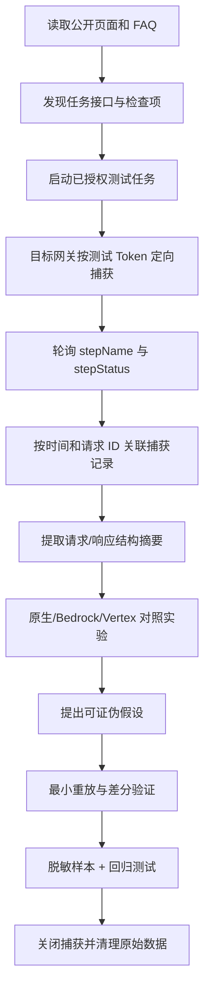
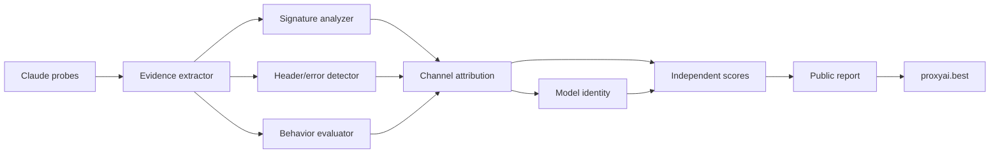

# proxyai.best 透明纯度检测北极星

版本：v0.1.0

日期：2026-07-25

状态：北极星设计与实施路线，供 `sub2api-admin-plus` 纯度检测后续演进使用。

## 1. 文档目的

本文沉淀一次 Claude API 兼容性排障的完整方法，并将其中可复用的能力转换为
`proxyai.best` 的产品与工程路线。

本次排障的关键结论不是“如何让 AWS Bedrock 看起来像 Anthropic 原生 API”，而是：

1. 协议兼容、模型身份、上游渠道和网关包装是四个不同问题，不能用一个“通过/失败”混在一起。
2. AWS Bedrock 可以高度兼容 Anthropic Messages，但其 thinking signature 仍然可以暴露真实渠道。
3. 第三方检测器如果无法识别签名变体，用户只会看到“签名失败”，却不知道它其实来自 AWS。
4. `proxyai.best` 应把这种模糊失败升级为可解释的渠道归因，例如“高置信度 AWS Bedrock”。
5. 检测器必须依据授权样本和可审计证据，不针对某个检测网站做响应伪装。

本文重点回答四个问题：

- 如何从公开前端、任务 API 和目标网关抓包还原一个黑盒检测流程。
- 如何把请求、响应和检测步骤精确关联，而不是依赖猜测。
- 如何从 Claude thinking signature 中提取可校准的渠道证据。
- 如何将这些能力实现为透明、可解释、可回归的纯度检测产品。

## 2. 边界与原则

### 2.1 目标

- 识别 Anthropic 原生、AWS Bedrock、Google Vertex、透明中转和未知兼容渠道。
- 分别给出协议兼容性、模型身份、渠道归因和计量可信度。
- 让用户知道“能否正常使用”“真实来源可能是什么”“证据有多强”。
- 对未知签名返回 `unknown`，而不是错误声称“官方”或“非 Claude”。
- 使用测试专用 Key、定向短时捕获和脱敏样本完成校准。

### 2.2 非目标

- 不伪造 Anthropic request ID、组织 ID、Cloudflare 头、限流头或 thinking signature。
- 不按 CCTest 的 User-Agent、IP、探针内容或任务时间返回特制响应。
- 不复制第三方未公开的专有 prompt；只实现独立设计、行为等价的探针。
- 不把透明中转程序名直接等同于模型掺假。
- 不把 AWS Bedrock、Google Vertex 等官方云渠道笼统标记为“低纯度”。
- 不保存 API Key、完整签名、完整 prompt、完整 completion、图片或文件正文。

### 2.3 核心判断原则

```text
协议兼容性 != 上游渠道
上游渠道 != 模型身份
模型身份 != 网关包装
网关包装 != 恶意混淆
```

一个合理结果可以同时是：

- Anthropic Messages 兼容性：95/100
- 模型身份：Claude Opus 4.8，一致
- 上游渠道：AWS Bedrock，高置信度
- 网关形态：new-api 透明中转
- 风险：未发现模型替换；WebSearch 能力受 Bedrock 限制

这比“签名校验失败，75 分”更准确，也更能帮助采购和开发者做决定。

## 3. CCTest 可公开观察到的契约

以下内容来自 2026-07-25 对 CCTest 公开页面、公开前端 bundle、公开 FAQ 和已授权测试任务的观察。
它不是 CCTest 的内部实现承诺，后续可能变化。

### 3.1 任务接口

公开前端当前使用以下流程：

```text
POST /api/check
  -> 返回 taskId

GET /api/check/{taskId}
  -> 轮询 status / progress / stepName / scores / result
```

公开文档还提供 `/api/v1/check/{taskId}` 形式的授权 API，但网页结果轮询当前使用的是
`/api/check/{taskId}`。实现自己的检测器时不能依赖第三方路径长期不变，应把外部观察脚本和产品代码隔离。

### 3.2 可见检查项与权重

公开前端 bundle 在本次观察时包含下列固定顺序：

| 顺序 | 字段 | 页面名称 | 分值 | 应归属的本地维度 |
| --- | --- | --- | ---: | --- |
| 1 | `tag_check` | LLM 指纹验证 | 10 | 模型身份 |
| 2 | `stream_structure` | 流结构校验 | 10 | 协议兼容性 |
| 3 | `non_stream` | 非流结构校验 | 5 | 协议兼容性 |
| 4 | `websearch` | WebSearch | 10 | 能力矩阵 |
| 5 | `signature_proto` | 签名校验 | 10 | 渠道归因 + 签名行为 |
| 6 | `output_config` | 结构化输出 | 10 | 能力矩阵 |
| 7 | `server_tool` | 工具调用 | 10 | 行为兼容性 |
| 8 | `token_inject` | Token 注入 | 5 | 请求完整性/混淆风险 |
| 9 | `knowledge` | 知识库检测 | 5 | 模型身份辅助证据 |
| 10 | `doc_recognition` | 文档识别 | 10 | 多模态能力 |
| 11 | `image_recognition` | 图片识别 | 10 | 多模态能力 |
| 12 | `fingerprint` | 协议合规性 | 5 | 整轮协议/包装指纹；服务端算法未公开 |

合计 100 分。Token 用量审计是可选的额外多轮检测，页面说明当前会增加约 11 轮请求。

### 3.3 CCTest 对签名的公开说明

CCTest FAQ 明确说明“签名校验”会解析 Protobuf thinking signature，并用它识别渠道来源；FAQ 也明确列出
`aws-bedrock` 和 `vertex` 渠道标签。

公开来源：<https://cctest.ai/zh/faq>

因此，签名项不是简单检查以下条件：

- 是否存在 `signature_delta`。
- signature 是否为 Base64。
- signature 长度是否合理。

真正的检查至少还会涉及：

- Base64 解码后的 Protobuf 结构。
- 结构中稳定的字段集合和值类型。
- 流式与非流式签名是否属于同一渠道族。
- 签名是否与 thinking block、模型和重放链行为一致。

### 3.4 本次任务的脱敏结果

本次已授权 Opus 4.8 检测任务 `f5baa2a0-1ca6-4b59-bb04-f9176e679ae8` 的结果为 75 分，
三个零分项为：

```json
{
  "websearch": 0,
  "signature_proto": 0,
  "fingerprint": 0,
  "total": 75,
  "expectedModel": "claude-opus-4-8",
  "responseModel": "claude-opus-4-8"
}
```

其余检查全部通过。这组数据说明：

- 模型名没有发生可见降级。
- 流式和非流式 Messages 生命周期已兼容。
- 结构化输出、server tool、文档和图片等功能可用。
- 失败集中在真实 WebSearch 能力、签名渠道来源和最后的协议/包装指纹。
- 不能把 75 分解释为“整体协议只有 75% 可用”。

## 4. 黑盒检测调试流程

### 4.1 总体流程



### 4.2 第一步：发现公开前端契约

先从公开 HTML 找到当前页面引用的 JavaScript chunk，再只搜索接口路径、步骤字段和权重字段。

示例：

```bash
curl -fsSL "https://cctest.ai/" \
  | rg -o '/_next/static/chunks/[^" ]+\.js'

curl -fsSL "https://cctest.ai/<result-page-chunk>.js" \
  | rg '/api/check|signature_proto|fingerprint|stream_structure'
```

这一步只用于发现公开客户端契约。不要把构建 hash 写死到产品代码，也不要依赖压缩变量名。

### 4.3 第二步：保存任务状态时间线

轮询任务结果时保存以下字段，不保存 Key：

```json
{
  "observed_at": "RFC3339 timestamp",
  "status": "running",
  "step": 4,
  "stepName": "signature",
  "progress": 0.42,
  "stepStatus": {
    "stream_structure": "done",
    "signature_proto": "running"
  }
}
```

推荐每 500 到 1000 ms 采样一次状态。步骤切换时间只能提供候选时间窗；并发请求、重试和评分项
复用响应都会造成错位。必须再结合 request ID、并发分组和请求/响应特征，才能把捕获记录归入检查项。

### 4.4 第三步：目标网关定向捕获

本次网关已经具备按 `token_name` 开关的短时 debug capture：

```text
POST /api/debug/capture/enable
POST /api/debug/capture/disable
GET  /api/debug/capture/status
GET  /api/debug/capture/list
GET  /api/debug/capture/{id}
```

建议参数：

```json
{
  "token_name": "<test-token-name>",
  "duration_seconds": 600
}
```

捕获系统必须满足：

- 只命中测试专用 Token，不做全局抓包。
- 自动过期，最大持续时间受限。
- `Authorization`、`x-api-key`、Cookie 等请求头落库前掩码。
- 请求体和响应体有严格大小上限。
- SSE 按实际发送字节捕获，保留事件顺序。
- 捕获写入不得阻塞正常响应。
- 原始记录只短期保存，校准样本只保留结构摘要。

`proxyai.best` 后续应实现等价的“授权采样会话”，并与现有
[授权样本采集 Runbook](../purity/AUTHORIZED_SAMPLE_RUNBOOK.md) 对齐。

### 4.5 第四步：把捕获记录映射到检查项

关联优先级：

1. CCTest `stepName` 切换时间窗。
2. 目标网关 `request_id` 与服务日志。
3. 请求结构特征，例如 `stream`、`thinking`、`tools`、`output_config`。
4. 响应结构特征，例如 `signature_delta`、`server_tool_use`、图片/文档输入。
5. 调用顺序，仅作为最后辅助，不应单独作为结论。

捕获文件序号不等于请求与响应的配对关系，也不等于评分步骤顺序。历史样本已出现并发/重试
导致的错位，例如编号 `0022` 的请求所对应的正确身份响应实际位于 `0023`。关联时必须优先使用
request ID、时间窗和内容特征；序号只能用于导航文件。

建议生成本地关联表：

| capture_id | observed_step | request_shape | response_shape | status | confidence |
| ---: | --- | --- | --- | ---: | --- |
| 101 | `signature_proto` | stream + adaptive thinking | thinking + signature | 200 | high |
| 102 | `output_config` | output schema + effort | JSON text | 200 | high |
| 103 | `server_tool` | versioned server tool | tool event sequence | 200 | medium |

如果一个步骤产生重试，要把所有尝试放进同一 probe group，而不是把每个请求误认为独立检查项。

### 4.6 第五步：先做结构摘要，再读取正文

每条捕获先提取以下摘要：

- HTTP 状态、Content-Type、延迟。
- 请求顶层字段集合。
- `model`、`stream`、thinking 类型、tool 类型集合。
- SSE event 类型序列和 block index 序列。
- 响应 model、message/tool ID 前缀。
- usage 字段集合和数值范围。
- signature 数量、Base64 长度、解码长度和结构 fingerprint。
- provider metadata 是否存在。

只有摘要无法解释失败时才查看脱敏正文。这样能降低敏感数据暴露，也能避免被具体 prompt 干扰判断。

### 4.7 第六步：对照实验

至少准备以下授权样本：

| 样本 | 用途 |
| --- | --- |
| Anthropic 原生 API | 原生 Messages、签名和错误行为基线 |
| AWS Bedrock 直连 | AWS 签名和能力边界基线 |
| AWS Bedrock 经透明网关 | 验证网关清洗后仍可归因 AWS |
| Google Vertex Claude | Vertex 签名与错误行为基线 |
| Claude-compatible mock | 验证未知兼容实现不会被误报为官方 |

所有样本使用相同的请求类别，不要求输出文本完全相同。比较的是协议结构、签名结构和行为约束。

### 4.8 第七步：差分验证

一次只改变一个变量：

```text
stream true        -> false
thinking adaptive  -> disabled
output_config on   -> off
server tool on     -> off
cache_control 4    -> 5
valid signature    -> invalid signature
Bedrock upstream   -> Anthropic upstream
```

如果关闭 thinking 后签名项消失，说明该 probe 依赖 thinking；如果只更换上游就改变 signature
结构，而网关版本、请求和模型不变，来源归因假设得到强验证。

### 4.9 第八步：结束捕获

无论任务成功还是失败，都必须执行：

1. 立即关闭捕获会话。
2. 确认 active session 数量归零。
3. 只导出需要的脱敏结构摘要。
4. 删除本地临时原始签名和完整响应。
5. 将可回归样本按 `authorized_redacted` 契约入库。

## 5. 本次排障得到的关键证据

### 5.1 部署与功能路径已排除

在得分任务对应时间窗中已确认：

- 容器健康并运行目标版本。
- CCTest 请求命中目标版本。
- 探针请求均返回可解析响应。
- 流式、非流式、结构化输出、server tool、文档和图片检查通过。

因此不能继续把零分归因于“旧镜像”“未部署”或“WebSearch 阻断后续步骤”。

### 5.2 thinking summary 缺失已修复，但签名来源没有改变

PR #52（`99d6599`）已部署并生效。该改动为 Opus 4.8 Bedrock 兼容路径补充客户端未显式提供的
`thinking.display: "summarized"`，作用边界是恢复 Bedrock 要求的 thinking summary 请求形态，
不修改 signature 内容或来源。

复杂逻辑请求已验证以下顺序：

```text
content_block_start(thinking)
thinking_delta x 16
signature_delta x 1
content_block_stop(thinking)
message_stop x 1
```

这证明 thinking 的事件结构已经修复。CCTest 仍给 `signature_proto=0`，说明其判定不只是检查
`signature_delta` 是否存在。

### 5.3 原生与 Bedrock signature 的结构差异

对 3 份 Anthropic 原生样本和 4 份 Bedrock 样本做严格 Base64 解码，再按 Protobuf wire format
解析，得到稳定差异：

| 特征 | Anthropic 原生样本 | AWS Bedrock 样本 |
| --- | --- | --- |
| Base64 | 合法 | 合法 |
| 顶层主要字段 | 2, 3 | 2, 3 |
| envelope 字段 | 1, 2, 3, 4, 5 | 1, 2, 3, 4, 5 |
| metadata 字段集合 | 1, 3, 5, 6, 7, 8, 11 | 1, 2, 3, 5, 6, 7, 8 |
| metadata field 2 | 无 | 固定 varint 值 |
| metadata field 11 | 36 字符文本 | 无 |
| model 文本 | `claude-opus-*` | `claude-opus-*` |
| block 文本 | `thinking` | `thinking` |

重要限制：

- 这里只证明两个授权样本族的结构稳定不同。
- field number 的业务含义未知时，不应自行命名。
- 不能仅凭一次样本把 field 11 解释为组织 ID 或账号 ID。
- 不保存或展示完整 signature。
- 不能用修改 Protobuf 字段的方式伪造原生签名，外层结构修改会破坏内部认证数据。

### 5.4 旧响应中的 AWS 明确信号

早期 Bedrock 响应还出现过：

- `msg_bdrk_` message ID。
- `amazon-bedrock-invocationMetrics`。
- Bedrock `ValidationException` 错误文案。
- Bedrock 不支持 Anthropic managed WebSearch server tool 的能力错误。

网关可以为了协议兼容清洗 ID 和 invocation metrics，但真实 thinking signature 保持不变。因此
“字段清洗后看不到 AWS”不等于“签名无法识别 AWS”。

### 5.5 “协议合规性”不是流式协议总分

当前结果中：

- `stream_structure=10/10`
- `non_stream=5/5`
- `fingerprint=0/5`

所以页面上的“协议合规性”是一个独立评分项，而不是 Messages 生命周期的总评价。但尚未确认它有
独立请求：现场一轮约有 10 个实际 API 请求，页面却有 12 个评分项，说明至少部分评分可能复用
响应或按整轮数据聚合判定。公开前端只展示 `fingerprint` 字段和权重，具体 evaluator 位于服务端，
当前不能把它描述为“最后一个独立 fingerprint probe”。
`proxyai.best` 不应复用这个容易误解的命名，建议拆成：

- `protocol_conformance`：协议事件和 JSON schema 是否合规。
- `gateway_fingerprint`：是否观察到网关/包装信号。
- `channel_attribution`：真实上游渠道推断。

透明网关 fingerprint 应作为事实展示，不应自动扣兼容分。

本次 16:10 测试开始前没有开启定向 debug capture，因此无法进一步确定 `fingerprint=0` 来自哪个
请求、响应字段或 header。历史 100% 原生样本同样包含 `X-New-Api-Version` 和
`X-Oneapi-Request-Id`，不能把这两个 header 直接认定为失败原因；历史原生与 Bedrock 的
`identity_platform` 探针也都曾返回 `claude_code`，同样不足以单独归因。

### 5.6 WebSearch 必须作为能力边界展示

Anthropic managed WebSearch 与普通客户端 tool use 不同：

- [Anthropic 官方 Web search tool 文档](https://platform.claude.com/docs/en/agents-and-tools/tool-use/web-search-tool)
  将该能力定义为 Claude API 托管工具，并说明它不适用于 Amazon Bedrock。
- [AWS Bedrock 官方 Claude tool use 文档](https://docs.aws.amazon.com/bedrock/latest/userguide/model-parameters-anthropic-claude-messages-tool-use.html)
  明确写明：`The Anthropic web_search_20250305 server tool is not supported on Amazon Bedrock.`

因此检测器应输出：

```text
能力：Anthropic managed WebSearch
结果：unsupported_by_upstream
渠道：AWS Bedrock
影响：不阻塞其他检查；不等于模型伪装
```

如果网关配置了真实搜索后端，应将其标为 `gateway_emulated` 或 `external_provider`，不能声称是
Bedrock/Anthropic 原生托管搜索。

### 5.7 证据台账与事实等级

为避免把一次现场观察永久固化为规则，每个归因结论都应记录来源等级：

| 等级 | 含义 | 本次示例 | 能否直接形成渠道规则 |
| --- | --- | --- | --- |
| 官方契约 | 厂商或检测器公开文档明确声明 | Bedrock 不支持 Anthropic managed WebSearch | 可以，但需记录文档版本和访问时间 |
| 授权观测 | 在用户授权目标上捕获的请求或响应 | CCTest 任务步骤、Bedrock signature 结构 | 需脱敏并由多个样本复核 |
| 差分证据 | 控制变量后稳定出现的结构差异 | 原生与 Bedrock metadata 字段族不同 | 可以作为 family 候选，不能用单样本定案 |
| 工程推断 | 由时序、行为或代码路径推测 | CCTest 的 `fingerprint` 聚合规则 | 只能进入待验证假设 |
| 产品决策 | 本项目对事实的展示和评分策略 | AWS 显示为官方云渠道 | 可以实施，但不能伪装成外部事实 |

每条检测规则至少保存 `source_type`、`observed_at`、`sample_count`、`detector_version` 和
`limitations`。公开报告必须区分“观察到”“推断为”和“尚未知”，规则评审时禁止把工程推断
升级为官方契约。

## 6. 如何反推黑盒检查，而不复制第三方实现

### 6.1 从状态机反推 probe registry

对每个检查项建立独立注册定义：

```go
type ProbeSpec struct {
    ID             string
    Dimension      string
    CostClass      string
    Required       bool
    Timeout        time.Duration
    BuildRequest   RequestBuilder
    Evaluate       ProbeEvaluator
    EvidencePolicy EvidencePolicy
}
```

公开前端步骤只用于发现“需要覆盖哪些能力”，具体 payload 和 evaluator 应由本项目独立设计。

### 6.2 用状态切换和请求特征确认每个 probe

一个检查项只有满足下列任意两项才可认为已反推出请求：

- 请求发生在该 step 的精确时间窗。
- 请求结构与检查目的唯一对应。
- 响应结构与页面得分变化一致。
- 同一请求重放能稳定复现结果。
- 对照上游只改变该项得分。

只根据请求顺序猜测，不进入事实库。

### 6.3 用正向和负向探针交叉验证

正向探针回答“是否支持能力”：

- 流式 Messages 生命周期。
- 非流式 message schema。
- tool use。
- 结构化输出。
- 图片和文档输入。

负向探针回答“是否执行官方约束”：

- 伪造 historical thinking signature 是否被拒绝。
- thinking budget 越界是否被拒绝。
- cache_control 数量越界是否被拒绝。
- 不支持字段是否返回稳定错误类型。

正向通过只能证明兼容；正向和负向共同符合，才增加“官方行为一致性”证据。

### 6.4 用随机 nonce 防止静态答案

行为探针需要加入每次不同的 nonce，并在响应中验证 nonce 或其确定转换：

- 避免供应商对固定问题缓存答案。
- 检测 system prompt 注入和请求篡改。
- 验证多轮上下文是否真实传递。

nonce 只进入短时请求，不应写入长期样本正文；长期样本只保存匹配结果和 hash。

### 6.5 用跨探针一致性替代单点结论

来源归因应组合：

```text
signature structural family
+ stream/non-stream consistency
+ provider-specific error behavior
+ capability boundaries
+ response/header metadata
+ model identity
= channel attribution with confidence
```

任何可被网关轻易增删的单一 header 都只能作为弱或中等证据。

## 7. proxyai.best 的北极星结果模型

### 7.1 四个独立结果轴

| 结果轴 | 回答的问题 | 推荐表达 |
| --- | --- | --- |
| Protocol Compatibility | 客户端能否按目标协议正常工作 | 0-100 分 |
| Model Identity | 返回模型是否与请求模型一致 | pass/warn/fail + 证据 |
| Channel Attribution | 真实上游最可能来自哪里 | channel + confidence |
| Metering Integrity | usage/cache/计费是否可信 | pass/warn/fail + 倍率 |

网关包装作为独立事实列表：

```text
wrapper_signals: [new-api]
obfuscation_signals: []
```

不要再用单一“纯度分”压平所有事实。可以保留总览分，但必须允许用户看到四轴原值。

### 7.2 渠道枚举

建议至少支持：

```text
anthropic_native
aws_bedrock
google_vertex
anthropic_compatible
kiro
antigravity
unknown
```

`new-api`、`sub2api`、`cliproxyapi` 属于 wrapper，不应与底层 channel 互斥。例如：

```json
{
  "channel": "aws_bedrock",
  "wrappers": ["new-api"]
}
```

### 7.3 渠道归因对象

```json
{
  "channel_attribution": {
    "channel": "aws_bedrock",
    "confidence": 0.96,
    "status": "identified",
    "evidence": [
      {
        "kind": "signature_structure",
        "strength": "strong",
        "summary": "Thinking signature matches the calibrated Bedrock structural family",
        "sample_count": 2
      },
      {
        "kind": "capability_boundary",
        "strength": "medium",
        "summary": "Managed WebSearch is unavailable on the selected upstream"
      }
    ],
    "contradictions": [],
    "limitations": [
      "No provider signing key is available for independent cryptographic verification"
    ]
  }
}
```

### 7.4 证据强度

| 强度 | 规则 | 示例 |
| --- | --- | --- |
| strong | 授权多样本稳定，网关难以无损伪造 | signature 结构族、云厂商认证错误 |
| medium | 多个行为一致，但可能由网关模拟 | provider 能力边界、usage/cache 组合 |
| weak | 可被简单添加或删除 | 单一 header、ID 前缀、根页面标题 |

置信度不能简单相加。相同来源的相关证据需要降权，避免三个 AWS header 被当成三份独立强证据。

### 7.5 已识别、未知和冲突

```text
identified: 至少一份 strong 证据，且没有同等级冲突
likely:     多份独立 medium 证据，或一份未充分校准的 strong 候选
unknown:    证据不足，不做负面推断
conflicted: 同时出现两个互斥渠道的 strong/medium 证据
```

`unknown` 不是失败。它意味着检测器需要更多授权样本。

## 8. Claude signature analyzer 设计

### 8.1 职责边界

signature analyzer 只负责：

- 从 JSON/SSE 中提取 thinking signature。
- 严格 Base64 解码。
- 安全解析 Protobuf wire structure。
- 生成不可逆结构 fingerprint。
- 与授权样本族比较。
- 输出渠道候选和置信度。

它不负责：

- 修改、补齐或伪造 signature。
- 声称能验证 Anthropic 私钥签名。
- 保存完整 signature。
- 将解析失败直接判为非 Claude。

### 8.2 安全解析约束

- 单个 signature Base64 长度上限。
- 解码字节长度上限。
- varint 最多 10 字节。
- field number 必须大于 0。
- 只接受 wire type 0、1、2、5。
- length-delimited 字段必须完全落在输入边界内。
- 递归深度限制，默认不超过 4。
- 不对随机二进制强行递归；只有完整消费子消息时才记录为 nested message。
- parser 必须有 fuzz test，任何输入都不得 panic 或无限循环。

### 8.3 结构 fingerprint

推荐只保存：

```json
{
  "decoded_length_bucket": "256-511",
  "top_level_fields": [2, 3],
  "envelope_fields": [1, 2, 3, 4, 5],
  "metadata_fields": [1, 2, 3, 5, 6, 7, 8],
  "metadata_value_types": {
    "1": "varint",
    "2": "varint",
    "3": "varint",
    "5": "bytes:64",
    "6": "text:model",
    "7": "varint",
    "8": "text:block_type"
  },
  "raw_sha256_prefix": "redacted-short-fingerprint"
}
```

`raw_sha256_prefix` 只用于同次采样去重，不作为渠道规则，也不应公开展示。

### 8.4 样本族而不是 magic value

不要写成：

```go
if field2 == 1 {
    return "aws_bedrock"
}
```

应建立带版本和样本数的族：

```go
type SignatureFamily struct {
    ID              string
    Channel         string
    ModelFamilies   []string
    RequiredFields  []FieldConstraint
    ForbiddenFields []FieldConstraint
    MinSamples      int
    SampledFrom     []string
    ValidFrom       time.Time
    ValidUntil      *time.Time
}
```

只有授权样本数量、模型覆盖和时间跨度达到阈值，family 才能产生 `identified`；否则只产生 `likely`。

### 8.5 流式与非流式一致性

同一检测任务应同时收集：

- 流式 `signature_delta`。
- 非流式 `content[].signature`。
- historical thinking signature 的重放行为。

若流式归因 AWS、非流式归因 Vertex，应输出 `conflicted`，不能选择分数更高的结果。

## 9. 检查项实现映射

### 9.1 LLM 指纹验证

目标：识别模型族和明显的跨厂商替换。

实现：

- 随机 tag/nonce 回显。
- 低温度逻辑问题。
- 模型自述只作为弱证据。
- 结合响应模型、工具行为、知识时间和延迟分布。

注意：知识题会随时间失效，必须版本化，不能单题决定模型身份。

### 9.2 流结构校验

至少验证：

```text
message_start
content_block_start
content_block_delta*
content_block_stop
message_delta
message_stop
```

额外验证：

- block index 连续且引用一致。
- thinking_delta 在 signature_delta 之前。
- tool input JSON 片段最终可拼成合法 JSON。
- `message_delta.stop_reason` 与内容类型一致。
- stream 断开和错误事件有明确状态。

### 9.3 非流结构校验

验证 `type=message`、role、content 数组、stop reason、usage、model 和 ID 的类型与约束。
非标准扩展字段单独记录，不应因为未知字段直接拒绝整个响应。

### 9.4 WebSearch

区分三种能力：

- `provider_native`：上游原生托管执行。
- `gateway_emulated`：网关调用外部真实搜索后端并转换协议。
- `unsupported`：返回标准能力错误，其他检查继续。

不得用固定文本或无真实来源的搜索结果制造成功。

### 9.5 签名校验

拆成两个检查：

1. `signature_behavior`：伪造 historical signature 是否被正确拒绝。
2. `signature_provenance`：返回签名属于哪个授权样本结构族。

当前 `sub2api-admin-plus` 已实现第 1 项，但 `signature_proto` 分数仍由负向探针 validation 映射，尚未实现第 2 项。
这是本路线最重要的工程缺口。

### 9.6 结构化输出

验证输出是否满足请求 schema，而不是只检查 HTTP 200 或文本看起来像 JSON。记录：

- schema keyword 支持范围。
- strict 行为。
- 非法 schema 的错误类型。
- 网关 fallback 是否改变用户语义。

### 9.7 server tool

按版本化工具分别检测，不能把普通客户端 `tool_use` 当成 provider 托管 server tool。

需要验证：

- 工具名称、type 和 version。
- `caller`/tool ID 引用。
- tool result 与 stop reason。
- 不支持工具的错误是否可恢复。

### 9.8 Token 注入

使用随机 nonce 和严格输出协议，检查：

- 用户消息是否被前置 system prompt 改写。
- 请求内容是否被静默删除或追加。
- 固定安全提示是否泄露。

该项只能报告“观察到请求改写信号”，不能推断改写目的。

### 9.9 知识库检测

作为模型身份辅助证据，题库必须：

- 有采样日期和适用模型版本。
- 每题权重低。
- 与逻辑、签名、usage、响应模型交叉验证。
- 定期淘汰已被训练或普遍检索到的题目。

### 9.10 文档与图片识别

使用项目自有的小型合成资产，保存资产 hash，不保存用户上传内容。分别验证 MIME、尺寸限制、OCR、图像理解和错误行为。

### 9.11 协议/包装 fingerprint

拆分事实：

- header fingerprints。
- 错误体 fingerprints。
- route surface fingerprints。
- ID/usage/SSE bridge fingerprints。
- signature bridge fingerprints。

普通 `new-api`、`sub2api`、`cliproxyapi` 信号只说明存在网关；只有模型、签名、usage 或协议被混淆时才降低风险评价。

### 9.12 Token audit

复用现有 OpenAI/Claude/Gemini 独立 audit 流，不把不同协议的缓存语义混用。报告中同时展示：

- 原始 usage 字段是否存在。
- 缓存创建和读取是否合理。
- 多轮上下文是否真实重放。
- 官方价格基线与实际倍率。
- 缺失轮次及其错误原因。

## 10. 后端架构演进

### 10.1 当前缺口

当前代码已经有：

- `claude.go` 的 Messages、流式、负向签名和多模态探针。
- `validation.go` 的 CCTest 风格 score breakdown。
- `channels/bedrock/detector.go` 的 header/text detector。
- `channel_signals.go` 的 wrapper signal 聚合。
- `model_identity.go` 的模型身份检查。
- `sample-calibration.md` 和 authorized sample 回归框架。

当前缺少：

- 返回 signature 的 Protobuf 安全解析器。
- 基于授权样本的 signature family registry。
- 独立 `channel_attribution` 报告对象。
- 渠道证据置信度和冲突处理。
- AWS/Vertex/原生 Claude 的签名样本矩阵。
- 前端“协议兼容”和“渠道来源”分开展示。

### 10.2 建议目录

```text
backend/internal/adminplus/app/purity/
  attribution/
    evaluator.go
    evidence.go
    confidence.go
  signature/
    extract.go
    protobuf_wire.go
    fingerprint.go
    registry.go
    classifier.go
  channels/
    bedrock/
      detector.go
      attribution.go
    claude/
      detector.go
      attribution.go
    vertex/
      detector.go
      attribution.go
  testdata/
    signature_families.json
    calibration_samples.json
```

遵循 KISS：wire parser 只实现解析结构所需功能，不引入完整 protobuf schema 推断器。

### 10.3 数据流



### 10.4 报告兼容升级

保留现有字段，新增字段：

```go
type PublicReport struct {
    // existing fields...
    ChannelAttribution *ChannelAttributionResult `json:"channel_attribution,omitempty"`
    CapabilityMatrix   []CapabilityResult        `json:"capability_matrix,omitempty"`
    ProtocolScore      int                       `json:"protocol_score"`
    MeteringScore      int                       `json:"metering_score"`
}
```

camelCase 兼容字段按现有报告构建方式同步，不在业务流程中维护两份事实源。

## 11. 评分与 verdict

### 11.1 不再让来源吞掉兼容分

建议：

- `protocol_score` 只计算 schema、SSE、tool、structured output、多模态和错误行为。
- `channel_attribution` 不作为 0/10 计分，而是渠道 + 置信度。
- `official_behavior_score` 计算负向约束、签名行为、缓存和官方专属能力。
- `model_identity` 作为独立 pass/warn/fail。
- `metering_score` 计算 usage/cache/成本倍率。

### 11.2 推荐 verdict

```text
official_native
official_cloud_channel
transparent_relay
compatible
compatible_with_limitations
identity_conflict
unavailable
unknown
```

AWS Bedrock 的典型结果应该是：

```text
verdict: official_cloud_channel
channel: aws_bedrock
protocol: anthropic_messages
compatibility: high
limitations: [managed_websearch_unsupported]
```

而不是因为没有 Anthropic 原生签名就变成 `invalid`。

### 11.3 防止分数被游戏化

- 不针对 Host/User-Agent 选择判定路径。
- 关键探针使用随机 nonce。
- 题库和签名 family 版本化。
- 多次运行观察稳定性，不以单次异常定性。
- 不公开所有行为探针的固定期望答案。
- 分数必须能追溯到 CheckResult 和 Evidence。
- 渠道置信度必须能解释支持与反对证据。

## 12. proxyai.best 前端北极星

### 12.1 输入区

沿用当前截图中的清晰结构：

- API 地址。
- API Key。
- 接口类型：OpenAI / Claude / Gemini。
- 模型预设与可编辑目标模型。
- Token audit 开关和预计请求数/成本。

增加高级选项：

- 渠道归因检测开关，默认开启。
- 授权主动探针说明。
- 预计请求数、最大耗时和预算。

### 12.2 结果首屏

首屏优先展示：

1. 模型身份：请求与响应是否一致。
2. 协议兼容分：客户端功能是否可用。
3. 渠道归因：Anthropic / AWS Bedrock / Vertex / unknown。
4. 渠道置信度：高/中/低及样本数量。
5. 网关包装：透明展示但不默认贬损。
6. 关键限制：WebSearch、缓存、server tool 等。

示例：

```text
Claude Opus 4.8
模型身份：一致
协议兼容：95/100
上游渠道：AWS Bedrock（高置信度）
网关：new-api
限制：Anthropic managed WebSearch 不受该上游支持
```

### 12.3 证据详情

每条证据展示：

- 来源类别。
- 证据强度。
- 脱敏摘要。
- 观察次数。
- 是否存在冲突。
- 检测器版本和采样时间。

不展示完整 signature、完整错误体、完整请求头或可重放的认证材料。

### 12.4 文案原则

推荐：

- “识别为 AWS Bedrock，模型为 Claude，协议高度兼容。”
- “检测到透明网关；未观察到模型替换证据。”
- “签名结构不在当前样本库中，渠道暂时未知。”

避免：

- “签名失败，所以不是 Claude。”
- “使用网关，所以模型不纯。”
- “无法识别，所以一定是逆向渠道。”

## 13. 分阶段实施计划

### P0：固化证据契约

- 新增 `ChannelAttributionResult` 和 Evidence schema。
- 定义 strong/medium/weak 与 identified/likely/unknown/conflicted。
- 保留现有报告兼容字段。
- 添加 JSON contract tests。

完成标准：前后端可以展示 `unknown`，且不会因此判模型失败。

### P1：安全 signature parser

- 实现 Base64 和 protobuf wire parser。
- 实现 SSE/JSON signature extractor。
- 实现结构 fingerprint。
- 添加边界测试和 fuzz test。

完成标准：随机输入不 panic，完整 signature 不落入报告或日志。

### P2：授权样本与 family registry

- 采集 Anthropic 原生、AWS Bedrock、Vertex 的流式/非流式样本。
- 每类覆盖至少两个模型或版本、多个独立请求。
- 写入脱敏结构样本。
- 建立 family version 和有效期。

完成标准：Bedrock behind gateway 仍可归因；未知样本不会被硬判。

### P3：渠道归因 evaluator

- 合并 signature、header、error、capability 和 behavior 证据。
- 处理相关证据降权和渠道冲突。
- 输出 reason codes。

完成标准：原生、Bedrock、Vertex、透明中转、冲突样本均有回归测试。

### P4：评分与 UI 拆分

- 协议分、模型身份、渠道归因、计量可信度分开展示。
- AWS 显示为官方云渠道，不显示为笼统签名失败。
- 证据详情完成中英文 i18n。
- PDF/导出报告包含渠道与置信度。

完成标准：用户无需理解 Protobuf，也能知道接口来自哪里、能否使用以及限制是什么。

### P5：持续校准

- 按季度或模型大版本更新授权样本。
- 监控 unknown/conflicted 比例。
- 规则变更必须通过历史样本回放。
- 新 family 先 shadow evaluation，再进入正式 verdict。

完成标准：规则升级不会导致历史透明中转大面积误判。

## 14. 测试矩阵

| 场景 | 协议 | 模型身份 | 渠道归因 | 包装 | 预期 |
| --- | --- | --- | --- | --- | --- |
| Anthropic 原生 | pass | pass | anthropic_native/high | none | official_native |
| Bedrock 直连 | pass | pass | aws_bedrock/high | none | official_cloud_channel |
| Bedrock + new-api | pass | pass | aws_bedrock/high | new-api | transparent_relay |
| Vertex 直连 | pass | pass | google_vertex/high | none | official_cloud_channel |
| 未知兼容实现 | pass | pass | unknown | compatible | compatible |
| 模型降级 | pass | fail | any | any | identity_conflict |
| AWS WebSearch unsupported | warn | pass | aws_bedrock/high | any | compatible_with_limitations |
| 流/非流来源冲突 | pass | warn | conflicted | any | compatible_with_limitations |
| 签名解析失败 | pass | pass | unknown | any | compatible，不因解析失败判非 Claude |

### 14.1 parser 测试

- 空字符串、非法 Base64、超长 Base64。
- 截断 varint、溢出 varint、field number 0。
- 非法 wire type。
- length 超界。
- 深层嵌套。
- 随机二进制 fuzz。
- 原生/Bedrock/Vertex 脱敏 fixtures。

### 14.2 evaluator 测试

- 单一弱 header 不产生 high confidence。
- 多个相关 header 不重复加权。
- signature strong 与 header medium 同向。
- signature strong 与 error strong 冲突。
- 已知 wrapper + 已知 upstream 可同时输出。
- unknown family 不触发 official/identity fail。

### 14.3 端到端测试

- SSE 完整生命周期。
- 非流 message。
- signature negative probe。
- thinking + signature 正向捕获。
- WebSearch unsupported 后继续后续检查。
- Token audit 开关关闭与开启。
- 报告 SSE 增量事件与最终报告一致。

## 15. 运营与隐私 Runbook

### 15.1 开始采样前

- 确认目标已授权。
- 使用测试专用、可撤销、低额度 Key。
- 记录 provider、模型、目标路径和预算。
- 开启定向捕获，不开启全局 debug body log。
- 设置 5 到 10 分钟自动过期。

### 15.2 采样过程中

- 只记录任务状态、请求结构摘要和必要响应结构。
- 观察日志量和数据库增长。
- 不在终端输出完整 API Key 或 signature。
- 若检测已完成，立即关闭捕获，不等待自动过期。

### 15.3 采样结束后

- 确认捕获会话关闭。
- 原始数据本地短期保存，不入 Git。
- 生成 `authorized_redacted` fixtures。
- 执行敏感字段扫描。
- 运行 purity 包测试。
- 在样本元数据记录采样时间和检测器版本。

## 16. 验收标准

### 产品验收

- AWS Bedrock 不再显示为无法解释的“签名失败”。
- 用户可以同时看到模型身份、协议兼容、渠道归因和网关包装。
- unknown 有明确含义，不带恐吓性结论。
- WebSearch 不支持不会阻塞其他检查。
- 报告可解释每一项分数和 verdict。

### 工程验收

- signature parser 有单测、fixture test 和 fuzz test。
- 完整 signature、API Key、Cookie 不进入报告、日志或 Git fixture。
- 渠道规则只依赖授权样本和公开可观察行为。
- 每个渠道至少有正样本、负样本和冲突样本。
- stream/non-stream attribution 分别执行并做一致性校验。
- 报告 snake_case/camelCase 兼容字段由同一事实源生成。
- 后端 purity tests、handler tests 和 proxyaiweb typecheck 全部通过。

### 伦理验收

- 不存在针对 `cctest.ai` Host、User-Agent、IP、固定 prompt 的条件分支。
- 不生成、替换或修改第三方 provider signature。
- 不伪造官方来源 header 或身份字段。
- 检测结果明确区分事实、推断、置信度和限制。

## 17. 决策记录

1. 将“签名行为校验”和“签名渠道归因”拆分，不再共用一个模糊 validation。
2. 将 AWS Bedrock 和 Google Vertex 定义为官方云渠道，而不是 Anthropic 原生渠道。
3. wrapper 与 channel 可以同时存在，二者不是同一枚举。
4. transparent wrapper 不自动扣协议兼容分；混淆证据才触发风险。
5. 不通过伪造响应追求第三方分数，优先修复真实协议缺陷和提升渠道识别能力。
6. 公开前端逆向只用于建立独立 probe coverage，不复制未公开的专有检测内容。
7. signature family 必须由授权样本校准，不能依赖一个 magic field。

## 18. 开放问题

- Opus 4.8、Sonnet 5 等新模型是否会改变 signature family，需要多少样本才能升为 high confidence？
- 同一模型跨 AWS region 或 inference profile 是否产生不同 family？
- Vertex API Key、Vertex OAuth、Antigravity bridge 的 signature 结构如何区分？
- 原生 Anthropic 不同组织、service tier 和 inference geo 是否改变 metadata 字段？
- CCTest 的 `fingerprint` 是复用单个响应还是聚合整轮数据，以及它检查协议细节、网关 surface
  还是两者组合？需要新的定向授权捕获确认。
- 渠道归因是否单独提供置信度百分比，还是只提供高/中/低以避免虚假精确？
- signature fixtures 的结构摘要应如何版本化和轮换，才能兼顾可审计性与安全性？

## 19. 后续实施入口

推荐从以下三个最小闭环开始：

1. 新增只读 signature extractor + protobuf wire parser，不改现有评分。
2. 使用现有授权原生/Bedrock 数据生成脱敏结构 fixtures，先做 shadow attribution。
3. 在 `proxyai.best` 报告中新增“上游渠道：AWS Bedrock / unknown”，暂不改变旧 verdict。

完成这个闭环后，再调整评分和文案。这样可以先证明渠道识别准确，再改变用户可见结论，避免一次性改动过大。
