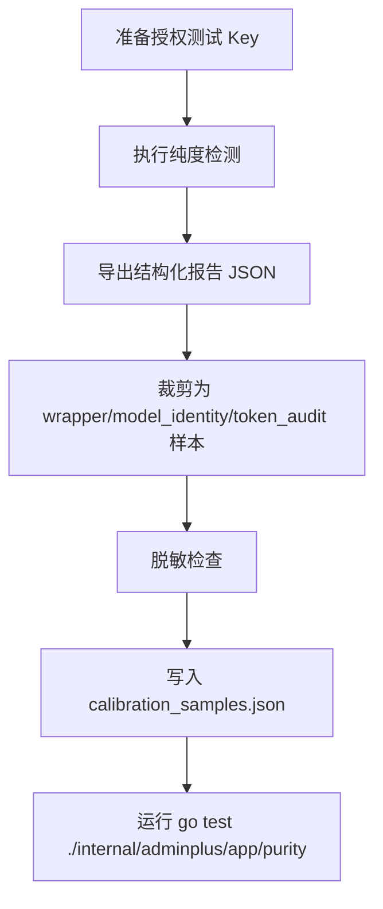

# 授权样本采集 Runbook

版本：v0.1.0
日期：2026-06-28
状态：用于 P5 真实授权供应商样本补充。

## 1. 采集前置条件

- 只采集已获得测试授权的目标 API，不采集未授权生产系统。
- 使用测试专用 API Key 或一次性低权限 Key。
- 采样前确认目标 provider、Base URL、模型 ID、是否允许执行 Token audit。
- 原始报告只能临时本地保存，不写入 Git。

## 2. 采集流程



## 3. 脱敏裁剪规则

- 删除 API Key、Authorization、Cookie、账号、邮箱、余额和完整账单信息。
- 不保存完整 prompt、completion、图片、文件、base64。
- 错误体只保留短错误原因、`status_code`、`error_class`、稳定错误 code/type。
- 响应头只保留 detector 白名单需要的字段。
- Base URL 只保留 host，不保存带 token 的 query。
- Token audit 只保留每轮 usage、成本估算、状态链字段和失败原因。

## 4. wrapper 样本模板

```json
{
  "sample_id": "authorized-openai-compatible-vendor-2026-06-28-001",
  "sample_kind": "authorized_redacted",
  "source_authorized": true,
  "sampled_at": "2026-06-28T00:00:00+08:00",
  "name": "authorized_openai_compatible_vendor",
  "host": "api.example.com",
  "provider": "openai",
  "model_id": "gpt-5.5",
  "expected_model": "gpt-5.5",
  "response_model": "gpt-5.5",
  "headers": [
    {
      "x-request-id": "redacted-request-id"
    }
  ],
  "values": [
    "{\"object\":\"response\",\"model\":\"gpt-5.5\",\"usage\":{\"input_tokens\":1,\"output_tokens\":1}}"
  ],
  "want_signals": [],
  "deny_signals": ["new-api", "sub2api", "cliproxyapi"],
  "want_obfuscation": false,
  "want_score_cap": 100
}
```

## 5. model_identity 样本模板

```json
{
  "sample_id": "authorized-openai-version-downgrade-2026-06-28-001",
  "sample_kind": "authorized_redacted",
  "source_authorized": true,
  "sampled_at": "2026-06-28T00:00:00+08:00",
  "name": "authorized_openai_version_downgrade",
  "provider": "openai",
  "model_id": "gpt-5.5",
  "expected_model": "gpt-5.5",
  "response_model": "gpt-5.4-mini",
  "wrapper_signals": [],
  "want_status": "fail",
  "want_reason": "version_downgrade"
}
```

## 6. token_audit 样本模板

```json
{
  "sample_id": "authorized-openai-token-audit-2026-06-28-001",
  "sample_kind": "authorized_redacted",
  "source_authorized": true,
  "sampled_at": "2026-06-28T00:00:00+08:00",
  "name": "authorized_openai_token_audit",
  "provider": "openai",
  "model_id": "gpt-5.5",
  "samples": [
    {
      "round": 1,
      "status": "pass",
      "input_tokens": 201,
      "output_tokens": 21,
      "total_tokens": 222,
      "official_baseline_usd": 0.001635,
      "actual_cost_usd": 0.001635,
      "prompt_cache_key": "redacted-cache-key",
      "store": true
    },
    {
      "round": 2,
      "status": "fail",
      "status_code": 400,
      "error_class": "request_error",
      "error_message": "unsupported parameter: prompt_cache_key"
    }
  ],
  "want_status": "warn",
  "want_summary_contains": "用量样本不完整",
  "want_anomalies": ["sample_or_ratio_anomaly"],
  "want_usable_samples": 1,
  "want_missing_samples": 1
}
```

## 7. 入库检查

入库前必须运行：

```bash
cd /Users/coso/Documents/dev/ai/openrelayllm/sub2api-admin-plus/backend
go test ./internal/adminplus/app/purity
```

测试会校验：

- 样本 ID 全局唯一。
- `authorized_redacted` 样本必须使用 `authorized-*` ID、`source_authorized=true` 和 RFC3339 `sampled_at`。
- synthetic 样本不得伪造授权字段。
- 样本不含 API Key、Bearer token、Cookie、邮箱等敏感信息。
- Token audit 失败轮次必须有可展示失败原因。
