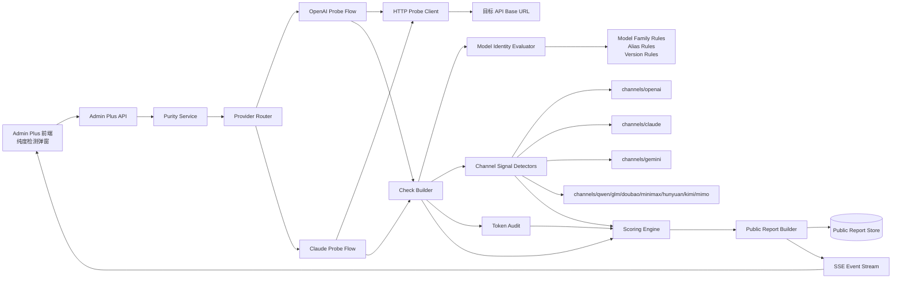
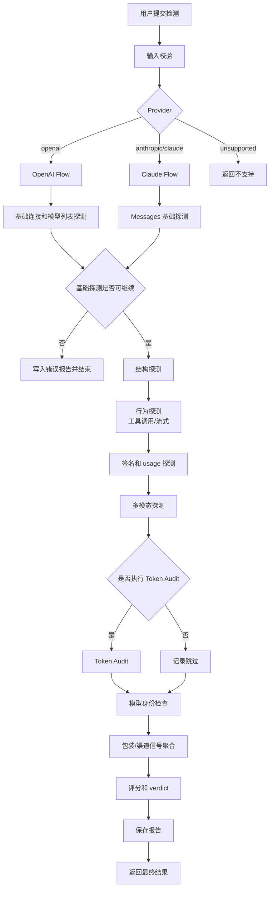
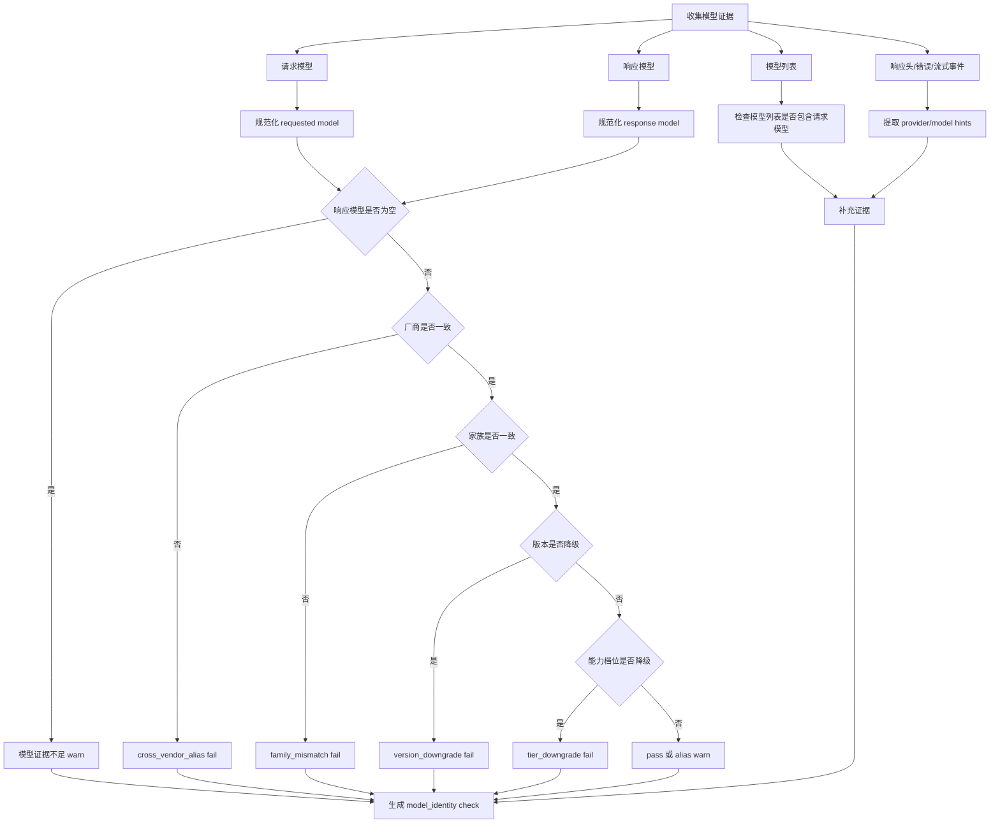
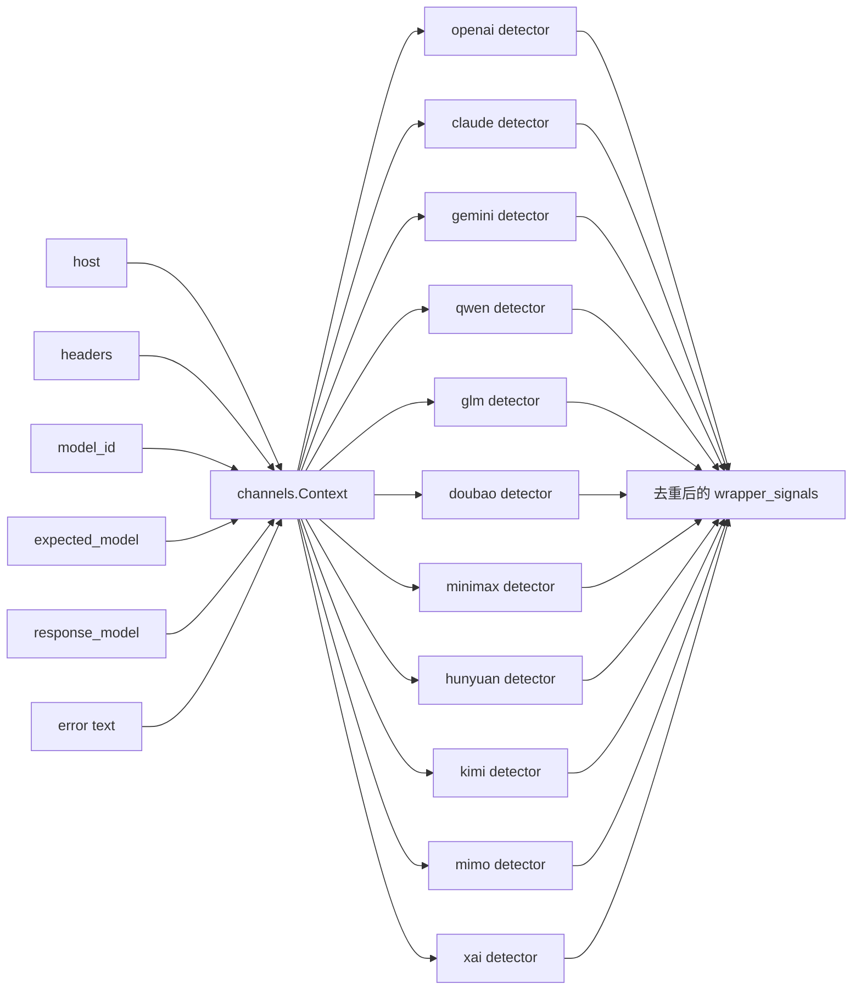
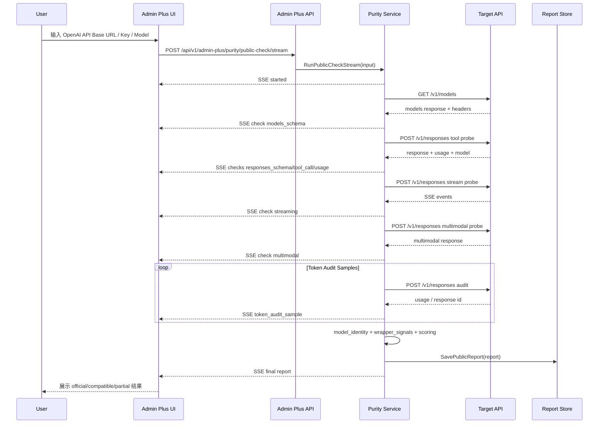
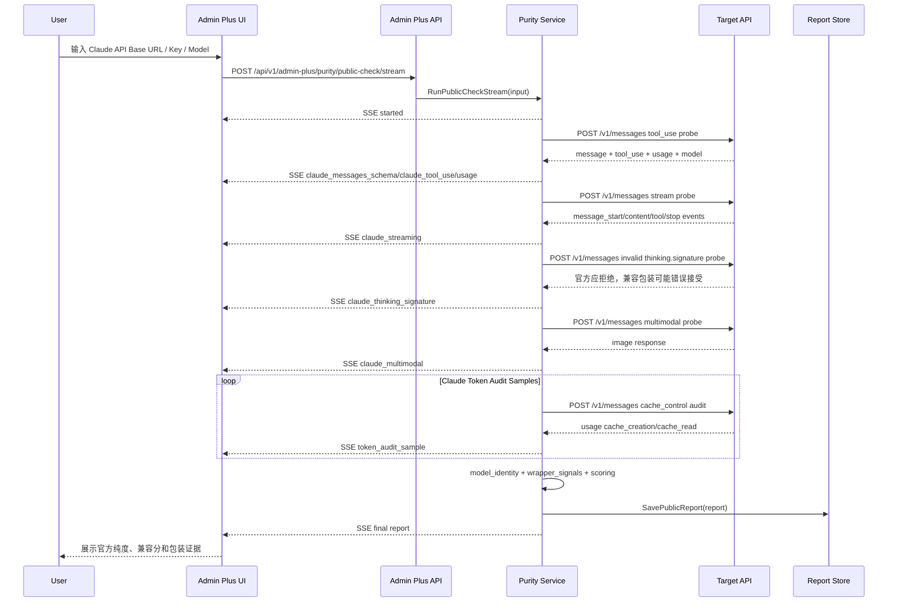
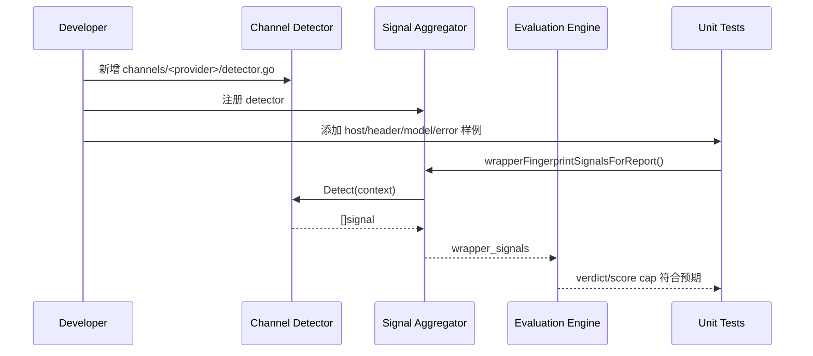

# API 纯度检测 PRD

版本：v0.1.0
日期：2026-06-28
状态：P0-P4 核心能力已落地，Gemini API Key 原生探针流已落地，P5 样本回归框架和样本校准契约已落地、真实授权供应商样本待补；OpenAI/Claude/Gemini flow 已完成文件级拆分，子包化可作为后续治理继续收敛；OpenAI `openai-model` 响应头、`reasoning_tokens` 身份信号、`store:false/include` 正向探针和 Token audit 失败诊断已进入 `model_identity` / `openai` 检查链路；国产模型预设、回归样例和 detector 指纹已按 2026-06-28 可查官方公开模型列表校正到 Qwen 3.7/3.6、GLM-5.2/5.1、Doubao Seed 2.1、Kimi K2.7 Code、MiniMax M2.7、HY3/A13B、MiMo V2.5、DeepSeek V4。
范围：OpenAI / Anthropic Claude / Gemini 及主流兼容、反代、包装通道的 API 纯度检测、模型身份一致性检测、评分和报告能力。

## 目录

1. 背景
2. 问题定义
3. 目标与收益
4. 非目标
5. 用户角色
6. 用户故事
7. 用户用例
8. 结果分层与术语
9. 检测策略
10. 模型身份一致性策略
11. 渠道覆盖范围
12. 评分模型
13. 总体架构
14. 后端模块拆分
15. 核心流程图
16. 核心时序图
17. 数据对象
18. API 与事件契约
19. 前端展示要求
20. 安全、合规与隐私
21. 测试与验收标准
22. 分阶段实施计划
23. 风险与应对
24. 开放问题

## 当前实现状态

- 后端已将纯度检测主流程从单一大文件拆分为 `openai.go`、`claude.go`、`report.go`、`evaluation.go`、`validation.go`、`events.go`、`http_probe.go`、`url.go`、`model_identity.go`、`wrapper_fingerprint.go`、`channel_signals.go` 等职责文件，`service.go` 保留对外入口和路由控制，并由 `architecture_test.go` 防止探针/评分/渠道细节回流。
- 当前可执行的原生探针流为 OpenAI 协议、Anthropic Claude 协议与 Gemini API Key 协议；`openai-compatible`、`openai compat`、`claude-compatible`、`anthropic-compatible`、`gemini-compatible`、`google ai studio` 等 provider 别名会归一到对应协议流。Qwen、GLM、Doubao、MiniMax、Hunyuan、Kimi、Mimo 等当前作为兼容/包装信号和模型身份厂商识别参与评分，尚未实现独立原生探针流。
- 渠道 detector 已按子文件夹拆分到 `backend/internal/adminplus/app/purity/channels/<channel>/detector.go`，覆盖 OpenAI、Claude、Gemini、Antigravity、Bedrock、CLIProxyAPI、new-api、sub2api、Qwen、GLM、Doubao、MiniMax、Hunyuan、Kimi、Mimo、xAI、DeepSeek。
- `Base URL` 只作为链路信息，不单独扣分、不单独封顶、不禁止 `official_*` verdict；只有模型身份、协议、usage/cache、签名、SSE 或错误体混淆证据触发降级。
- 已新增 `model_identity` 和 `wrapper_fingerprint` 检查项，并在报告中输出 `expected_model`、`response_model`、`wrapper_signals`、`model_identity` 及 camelCase 兼容字段。
- Admin Plus Vue 前端已在纯度检测弹窗首屏展示请求模型、响应模型、模型身份、疑似上游厂商、包装信号，并补充 `model_identity` / `wrapper_fingerprint` 验证项，PDF 导出已包含模型身份、疑似上游厂商和包装证据。
- 独立站 `proxyaiweb` React 前端已同步 schema、验证项、运行中/失败报告字段；结果页保留 verdict、核心指标、验证进度和 Token audit 报告，已移除重复的分数卡、证据卡和后端探针明细块；新增文案走 i18n，`src/lib/i18n.tsx` 仅保留运行时入口，翻译字典已拆到 `src/lib/i18n/`，PDF 导出已包含模型身份、疑似上游厂商和包装证据；模型控件支持 OpenAI/Claude/Gemini 官方预设、主流国产兼容模型预设和可编辑目标模型 ID。
- OpenAI/Claude Token audit 已增加独立总超时与单轮超时；OpenAI state/cache 参数不兼容时会自动降级为最小 Responses usage 请求，并在 `TokenAuditSample` 中透出 `status_code`、`error_class`、`error_message`。前端会隐藏无 usage 的 0 数据样本，同时在 Token audit 面板显示失败轮次原因。
- 已建立 `backend/internal/adminplus/app/purity/testdata/calibration_samples.json` 样本回归框架，并补充 [样本校准契约](sample-calibration.md) 和契约测试，覆盖 sub2api 组合证据、CLIProxyAPI 混淆、国产模型信号、模型身份降级、Token audit fallback 和失败原因透传；P5 仍需引入真实授权供应商样本做持续校准。
- 已通过后端 purity 相关 Go 测试、Admin Plus 前端 typecheck、proxyaiweb typecheck 和 proxyaiweb test。

## 1. 背景

Admin Plus 已经具备本地账号、供应商、渠道和检测能力。随着第三方 AI 网关、反向代理、OpenAI 兼容协议、Anthropic 兼容协议和多模型聚合平台变多，用户仅凭一个 API Base URL 和模型名已经无法判断真实上游。

当前市场上的“兼容 API”大致分为四类：

1. 官方 API：OpenAI 官方、Anthropic 官方、Google 官方等。
2. 协议兼容 API：接口形态兼容 OpenAI 或 Anthropic，但上游来自其他厂商。
3. 透明中转/反代 API：使用 CLIProxyAPI、new-api、sub2api 等程序转发请求，但不混淆模型身份、不改写关键计量、不伪造官方上游。这类使用本身是合法且可接受的；不能仅凭程序名或 Base URL 判断官方纯度，需要看黑盒证据链。
4. 混淆型包装/反代 API：对外伪装成官方协议，同时改写请求、响应、模型名、usage、签名、缓存身份或流式事件。
5. 模型身份伪装 API：例如用低版本或异厂商模型冒充高版本模型，将 `claude-4.6` 包装成 `claude-4.8`，将 `gpt-5.4` 包装成 `gpt-5.5`，或将 `glm` / `qwen` / `kimi` / `doubao` 等兼容模型伪装成 OpenAI / Claude 名称。

此前纯度检测主要关注“接口能否调用”和“基础协议是否兼容”，对以下问题识别不足：

- 过去过度依赖 API Base URL 官方域名，导致真实中转链路的上游纯度无法被客观评估。
- Kiro、Antigravity、CLIProxyAPI、new-api、sub2api、OpenAI compatible 聚合网关等包装信号不完整。
- Claude 兼容接口可以通过基本 Messages 探测，但不能通过官方签名、缓存计量和严格协议行为。
- OpenAI 兼容接口可以返回合法 JSON，但可能不支持 Responses 状态链、`store:false/include`、工具调用、流式事件细节或真实 usage。
- 响应中的模型名可能被反代重写，模型列表可能显示别名而非真实上游。
- 国产主流模型厂商普遍支持 OpenAI 兼容协议，不能只按协议判断“OpenAI 纯度”。

因此需要重新设计纯度检测：把“协议兼容”和“官方纯度”分开，把“透明中转存在”和“混淆/伪装风险”分开，把“模型身份伪装”作为独立风险信号，并将每个渠道拆分到独立模块，便于后续演进。

## 2. 问题定义

### 2.1 当前核心问题

| 问题 | 表现 | 影响 |
|------|------|------|
| 官方与兼容混淆 | 只看 Base URL 或只看协议通过都不够 | 用户错误判断真实上游、稳定性和计费口径 |
| 包装信号不足 | 只识别少量 Kiro / Vertex 特征 | CLIProxyAPI、new-api、sub2api、OpenRouter、Antigravity 等漏检 |
| 模型伪装难识别 | 响应模型名被改写，模型列表展示别名 | 低版本/异厂商模型冒充高价或高能力模型 |
| 代码职责混杂 | `service.go` 过大，OpenAI、Claude、评分、HTTP、报告混在一起 | 后续每个渠道独立演进困难，测试粒度粗 |
| 报告解释不足 | 分数只说明成功/失败，缺少证据链 | 用户无法判断为什么不是官方纯度 |
| 国产兼容模型缺位 | minimax、glm、mimo、qwen、doubao、hunyuan、kimi 等没有统一识别 | 主流兼容接口被漏判或误判 |

### 2.2 关键判断原则

纯度检测不能只问“能不能返回结果”，而要回答四个问题：

1. 这个入口是不是官方 API 域名和官方协议？
2. 这个入口是不是某类兼容、反代或聚合通道？
3. 如果存在中转，它是透明转发，还是存在模型/协议/计量混淆？
4. 这个入口返回的模型是否与请求模型一致？
5. usage、流式、工具调用、缓存、签名等行为是否符合对应官方协议的细节？

## 3. 目标与收益

### 3.1 产品目标

1. 支持 OpenAI 和 Anthropic Claude API Key 的官方纯度检测。
2. 支持 OpenAI compatible 和 Anthropic compatible 的兼容能力评分。
3. 识别常见包装、反代、聚合和厂商兼容通道。
4. 识别模型身份不一致、跨厂商伪装、版本降级、别名包装和响应模型改写。
5. 将每个渠道拆成独立文件夹和检测器，后续可以按渠道独立迭代。
6. 输出接近 cctest.ai 风格的结构化报告字段，同时保留 Admin Plus 自有字段。
7. 让报告可以解释“为什么不是官方”“像哪个通道”“模型身份哪里不一致”“风险等级是多少”。

### 3.2 用户收益

- 管理员可以快速判断一个 API Key 是官方、兼容、反代还是不可用。
- 运营可以在接入第三方供应商前发现模型伪装、usage 异常和协议降级。
- 技术排障可以根据检查项、响应头、模型名、流式事件和 token audit 定位问题。
- 采购和成本管理可以发现用低成本模型冒充高价模型的风险。
- 后续新增 qwen、glm、doubao、kimi 等渠道时，不需要改动核心 service 主流程。

### 3.3 工程收益

- 拆分大文件，降低 `service.go` 复杂度。
- 每个渠道一个子包，符合单一职责和开放封闭原则。
- 检测信号、评分、报告、HTTP 探针、模型身份规则分层。
- 单元测试可以按渠道、模型身份、评分和报告分别覆盖。

## 4. 非目标

- 不承诺百分百识别所有混淆型反代。检测结果是基于证据链和风险评分的判断。
- 不主动绕过第三方风控或安全机制。
- 不要求用户提供账号密码，只使用用户主动输入或已授权保存的 API Key。
- 不执行高消耗压测，检测请求必须有明确预算和超时。
- 不把所有兼容 API 或中转程序判定为恶意。CLIProxyAPI、new-api、sub2api 等透明中转可以是合法、可接受的供应商形态，只是不能等同官方 API；只有出现模型身份、协议、usage、签名、缓存身份等混淆证据时才进入风险降级。
- 不在前端暴露完整 API Key、请求体敏感信息或原始上游错误中的密钥片段。

## 5. 用户角色

| 角色 | 关注点 | 典型操作 |
|------|--------|----------|
| 平台管理员 | API Key 是否官方、是否安全、是否能进入生产候选 | 发起纯度检测、查看报告、导出证据 |
| 运营人员 | 第三方供应商模型是否真实、是否稳定、成本是否合理 | 批量检测供应商入口、筛选异常供应商 |
| 技术排障人员 | 协议细节、流式事件、usage、缓存、签名失败原因 | 查看检查项详情、响应头信号、错误分类 |
| 采购/财务 | 是否存在高价模型名对应低价上游模型 | 查看模型身份一致性和 token audit 成本倍率 |
| 开发者 | 新增渠道检测器、调整评分规则 | 在渠道子包内扩展检测逻辑和测试 |

## 6. 用户故事

1. 作为管理员，我希望输入一个 OpenAI API Base URL 和 Key 后，系统告诉我真实上游是否具备 OpenAI 官方级纯度，以便决定是否标记为高纯渠道。
2. 作为管理员，我希望自定义/中转 Base URL 不因域名本身被降级，只有出现混淆、降级、计量异常或协议缺陷时才降低纯度。
3. 作为运营，我希望系统识别 CLIProxyAPI、new-api、sub2api、OpenRouter、Kiro、Antigravity 等包装信号，以便知道真实链路可能经过代理。
4. 作为运营，我希望系统识别 minimax、glm、mimo、qwen、doubao、hunyuan、kimi 等国产兼容模型信号，以便区分“OpenAI 协议兼容”和“OpenAI 官方模型”。
5. 作为采购，我希望系统能发现 `gpt-5.4` 冒充 `gpt-5.5`、`claude-4.6` 冒充 `claude-4.8`、`qwen` 冒充 `gpt` 这类模型身份风险，以便防止被错误计费。
6. 作为技术排障人员，我希望看到每个检查项的请求阶段、得分、错误分类、响应头证据和模型证据，以便复现问题。
7. 作为开发者，我希望 Claude、OpenAI、Gemini、Qwen、GLM 等渠道都有独立文件夹，以便单独演进规则。
8. 作为开发者，我希望新增渠道只需要新增 detector 和测试，不需要改核心流程，以便降低回归风险。

## 7. 用户用例

### UC-01 检测 OpenAI 官方 API Key

| 项目 | 说明 |
|------|------|
| 触发角色 | 管理员 |
| 前置条件 | 用户持有 OpenAI 官方 API Key |
| 输入 | provider=openai、api_base_url=https://api.openai.com、model_id |
| 主流程 | 校验 URL -> 探测 `/v1/models` -> 探测 `/v1/responses` -> 探测工具调用 -> 探测流式事件 -> 探测多模态 -> token audit -> 评分 |
| 成功结果 | verdict=official_openai，官方纯度高分 |
| 异常 | 鉴权失败、余额不足、模型不存在、网络不可达 |

### UC-02 检测 OpenAI compatible 入口

| 项目 | 说明 |
|------|------|
| 触发角色 | 运营 |
| 前置条件 | 用户持有第三方 compatible API Key |
| 输入 | provider=openai、自定义或中转 api_base_url、model_id |
| 主流程 | 记录 Base URL 链路信息 -> 执行 OpenAI Responses/Chat 兼容探测、`store:false/include` 正向探针 -> 收集 wrapper signals -> 校验模型身份、usage/cache、SSE 和签名链路 |
| 成功结果 | 无混淆且核心探测通过时可判 official_openai；否则按证据判 openai_compatible 或 partial_compatible |
| 关键规则 | Base URL 域名本身不封顶、不禁止 official verdict；混淆证据才降级 |

### UC-03 检测 Anthropic Claude 官方 API Key

| 项目 | 说明 |
|------|------|
| 触发角色 | 管理员 |
| 前置条件 | 用户持有 Anthropic 官方 API Key |
| 输入 | provider=anthropic、api_base_url=https://api.anthropic.com、model_id |
| 主流程 | 探测 `/v1/messages` -> 工具调用 -> 流式 -> thinking signature 负向探针 -> 多模态 -> Claude token audit |
| 成功结果 | verdict=official_claude，签名和缓存计量通过 |
| 异常 | 兼容端点不支持 signature 约束、usage 缺字段、缓存读写异常 |

### UC-04 检测 Claude compatible / Kiro / Antigravity 包装

| 项目 | 说明 |
|------|------|
| 触发角色 | 运营 |
| 输入 | provider=anthropic、自定义或中转 Claude API Base |
| 主流程 | 执行 Claude Messages 探测 -> 收集 Kiro/Antigravity/header/model 信号 -> 执行签名负向探针 -> 执行 token audit |
| 成功结果 | 无混淆且核心探测通过时可判 official_claude；否则按证据判 claude_compatible 或 partial_compatible |
| 关键规则 | Base URL 和透明中转信号不禁止 official_claude；混淆证据、签名异常或 usage/cache 异常才降级 |

### UC-05 检测模型版本降级

| 项目 | 说明 |
|------|------|
| 触发角色 | 采购/运营 |
| 输入 | 请求模型为 `gpt-5.5`、响应模型为 `gpt-5.4` 或无响应模型但行为/价格像低版本 |
| 主流程 | 规范化请求模型 -> 规范化响应模型 -> 比较厂商、家族、主版本、小版本、能力后缀 -> 结合模型列表和 token audit |
| 成功结果 | 增加 `model_identity` warn/fail 检查，降低官方分 |
| 异常 | 官方 alias、latest 指针、预览模型需要按白名单处理 |

### UC-06 检测跨厂商伪装

| 项目 | 说明 |
|------|------|
| 触发角色 | 管理员/运营 |
| 输入 | 请求模型 `claude-opus-4-8`，响应模型或 header 暴露 `glm`、`qwen`、`kimi`、`gemini` |
| 主流程 | 解析厂商品牌 -> 比较 provider 与模型品牌 -> 收集 wrapper/channel signal -> 标记 cross_vendor_alias |
| 成功结果 | 报告显示“Claude 协议兼容但疑似非 Anthropic 上游” |
| 关键规则 | 跨厂商兼容可以合法存在，但必须从官方纯度评分中扣分 |

### UC-07 开发者新增渠道检测

| 项目 | 说明 |
|------|------|
| 触发角色 | 开发者 |
| 前置条件 | 已确认新渠道的 host/header/model/error 特征 |
| 主流程 | 新增 `purity/channels/<channel>/detector.go` -> 注册 detector -> 添加单元测试 -> 更新 PRD 覆盖表 |
| 成功结果 | 不改核心 `runCheck` 主流程即可识别新渠道 |

### UC-08 使用兼容协议 provider 别名

| 项目 | 说明 |
|------|------|
| 触发角色 | 开发者/API 调用方 |
| 输入 | `provider=openai-compatible`、`provider=openai compat`、`provider=claude-compatible` 或 `provider=anthropic-compatible` |
| 主流程 | provider 归一化 -> 进入 OpenAI 或 Claude 对应协议探针 -> 收集 wrapper/model identity 信号 |
| 成功结果 | 不因 provider 别名被错误拒绝；报告中的 `provider` 仍输出规范协议值 `openai` 或 `anthropic` |
| 边界 | `qwen`、`glm` 等不会被自动归入 OpenAI/Claude/Gemini 原生探针，只作为兼容/包装信号和模型身份线索参与识别；如果后续需要，可为特定厂商单独新增 native flow。Gemini API Key 已进入 Gemini 原生探针，OAuth/Vertex 仍待后续扩展 |

## 8. 结果分层与术语

### 8.1 Verdict

| verdict | 含义 | 典型场景 |
|---------|------|----------|
| `official_openai` | OpenAI 官方 API，协议和关键行为均通过 | `api.openai.com`，Responses、usage、stream、tool 正常 |
| `openai_compatible` | OpenAI 协议兼容度较高，但存在混淆、缺陷或证据不足，不能判定为官方纯度 | new-api、sub2api、OpenRouter、国产模型 OpenAI 兼容入口 |
| `official_claude` | Anthropic 官方 API，Messages、签名、usage、stream 通过 | `api.anthropic.com`，Claude 行为完整 |
| `claude_compatible` | Claude Messages 兼容度较高，但存在混淆、缺陷或证据不足，不能判定为官方纯度 | Kiro、Antigravity、Claude-compatible 反代 |
| `official_gemini` | Google Gemini 官方 API Key 协议，models、GenerateContent、tool、stream、usageMetadata 通过 | `generativelanguage.googleapis.com` 或等价 Gemini API 行为完整 |
| `gemini_compatible` | Gemini API 兼容度较高，但存在混淆、缺陷或证据不足，不能判定为官方纯度 | AI Studio compatible、sub2api/new-api Gemini relay |
| `partial_compatible` | 兼容受限 | 仅 Chat Completions 可用、stream 或 usage 不完整 |
| `invalid_or_unavailable` | 鉴权、网络、基础协议不可用 | Key 无效、余额不足、模型不存在、上游不可达 |
| `unknown` | 尚未完成检测或无法判断 | 初始化状态 |

### 8.2 分数含义

| 分数 | 解释 |
|------|------|
| `official_score` | 官方纯度分，用于判断是否接近官方 API |
| `compatibility_score` | 协议兼容分，用于判断业务上能否作为兼容入口 |
| `score/total` | 面向 cctest 风格展示的最终分，当前与 official_score 对齐 |

### 8.3 信号分类

| 信号 | 说明 |
|------|------|
| `wrapper_signals` | 包装、反代、聚合、兼容厂商信号 |
| `model_identity` | 请求模型与响应模型、模型列表、厂商家族是否一致 |
| `token_audit.anomalies` | usage、成本倍率、缓存读写、状态链异常 |
| `stream_channel` | 流式响应推断出的通道 |
| `non_stream_channel` | 非流式响应推断出的通道 |

## 9. 检测策略

### 9.1 检测维度

| 维度 | OpenAI | Claude | 说明 |
|------|--------|--------|------|
| Base URL | 记录 host 与是否官方域名 | 记录 host 与是否官方域名 | 仅作链路信息，不单独扣分或封顶 |
| 模型列表 | `/v1/models` schema 和模型存在性 | 后续可补 Anthropic models | 用于发现别名、缺失和厂商模型 |
| 非流式结构 | `/v1/responses` | `/v1/messages` | 检查 schema、content、id、usage |
| 工具调用 | Responses tool call | Claude tool_use | 检查函数调用结构 |
| 流式事件 | SSE event/data、completed | message_start/content/tool/stop | 检查流式协议细节 |
| usage | input/output/cache/reasoning | input/output/cache_creation/cache_read | 计量字段完整性 |
| 签名 | usage 和状态链 | thinking.signature 负向探针 | Claude 重点检查签名约束 |
| 多模态 | input_image | image block | 检查图片输入兼容性 |
| Token audit | prompt_cache_key、previous_response_id | cache_control、cache read/write | 发现 usage 和成本异常 |
| 模型身份 | request/response/list/header/error | request/response/header/error | 发现别名和伪装 |

### 9.2 中转与混淆检测信号

检测输入包括：

- API Base host
- 响应头 key/value
- 请求模型 `model_id`
- 预期模型 `expected_model`
- 响应模型 `response_model`
- 上游错误信息中的 provider/model 字段
- 模型列表中的模型 ID
- 流式事件中的 model/modelVersion 字段

信号分为两类：

- 透明中转信号：证明链路可能经过 CLIProxyAPI、new-api、sub2api、LiteLLM、OpenRouter 等网关。该信号本身不代表恶意，也不代表模型不真实。
- 混淆风险信号：证明存在或疑似存在模型 alias/ForceMapping、跨厂商协议桥接、Codex 身份改写、Claude/Gemini/OpenAI 签名转换、usage/cache 异常等行为。该信号会触发更低的 official_score 上限。

示例透明中转信号：

| signal | 触发特征 |
|--------|----------|
| `cliproxyapi` | `cliproxy`、`cli-proxy`、`CLI Proxy API Server`、`x-cpa-*`、`cpa-support-plugin`、`Access-Control-Expose-Headers: X-CPA-*` |
| `new-api` | `new-api`、`newapi`、`oneapi`、`x-new-api-version`、`x-oneapi-request-id` |
| `sub2api` | `sub2api`、`sub2-api`、`proxyai.best`、`X-Client-Request-ID` 结合 sub2api 路由组合、`/setup/status` 标准响应、`/api/event_logging/batch` 空 200 |
| `openai-compatible` | `openai-compatible`、`openai-compatibility` |
| `openrouter` | `openrouter` |
| `kiro` | `kiro` header、host、model 或 error 文本 |
| `antigravity` | `antigravity` |
| `vertex` | `vertex`、`googleapis.com`、`x-goog-request-id`、`x-cloud-trace-context` |
| `aistudio` | `aistudio`、`ai-studio` |
| `bedrock` | `bedrock`、`x-amzn-requestid`、`x-amzn-trace-id` |

示例混淆风险信号：

| signal | 触发特征 | 风险说明 |
|--------|----------|----------|
| `cliproxyapi-codex-identity` | `prompt_cache_key`、`Session_id`、`Conversation_id`、`Thread-Id`、`X-Codex-Window-Id`、`X-Codex-Turn-Metadata` 组合出现或被同步改写 | Codex 会话/cache 身份可能被代理层重写 |
| `cliproxyapi-model-mapping` | `force-mapping`、`model-aliases`、`oauth-model-alias`、`requested_model`、`upstream_model`、`mapping_chain` | 客户端可见模型名可能不是实际上游模型 |
| `cliproxyapi-signature-bridge` | `skip_thought_signature_validator`、`signature_delta`、`thinking_delta`、`encrypted_content`、`reasoning_content`、`native_finish_reason`、`gemini#` / `claude#` / `gpt#` | Anthropic / Gemini / OpenAI reasoning 或签名协议被桥接 |
| `sub2api-model-mapping` | `/v1/models` 暴露自定义 mapped model 列表、请求模型与 SSE/JSON `model` 被替换回 alias、错误或管理审计泄露 `requested_model` / `upstream_model` / `model_mapping_chain` | sub2api 账号级 `model_mapping`、通配符映射或 compact 专用映射可能隐藏真实上游模型 |
| `sub2api-protocol-bridge` | 同一 Base 同时命中 `/v1/messages`、`/v1/responses`、`/chat/completions`、`/v1beta/models`、`/backend-api/codex/responses`、`/antigravity/v1*`，且响应模型/错误格式显示跨协议转换 | OpenAI、Claude、Gemini、Antigravity/Codex 兼容层发生协议桥接，需和模型身份、usage/cache 审计联合判断 |
| `wrapper_vendor_signal_mismatch` | 请求 `gpt` 但 header/body 暴露 `qwen`、`glm`、`kimi`、`gemini` 等 | 可能存在跨厂商上游 |

弱证据约束：

- `X-Client-Request-ID`、`/v1beta/models`、`/backend-api/codex/responses` 等可以出现在 sub2api、CLIProxyAPI 或其他兼容网关中，不能单独触发 CLIProxyAPI 或 Codex 身份混淆。
- 只有出现 `X-CPA-*`、`CLI Proxy API Server`、`responses/compact`、`responses_websockets`、Codex 专用 header、model alias 或 signature bridge 等更强证据时，才输出 CLIProxyAPI 特定混淆信号。

### 9.3 sub2api 黑盒指纹

`sub2api` 不默认暴露类似 `X-New-Api-Version` 的版本头，因此不能只靠单个 header 强判。检测必须采用“多证据组合”：路由存在性、响应头、错误体、模型列表、SSE/JSON 模型字段和协议桥接行为同时出现时，才提高置信度。

| 类别 | 可观测位置 | 指纹 | 证据强度 | 说明 |
|------|------------|------|----------|------|
| 网关链路头 | HTTP header | `X-Client-Request-ID: <uuid>` | 中 | sub2api 网关路由会生成该 header；单独出现不唯一，需和路由/错误体组合 |
| 健康检查 | `GET /health` | `{"status":"ok"}` | 弱 | 低风险探测，只能作为辅助证据 |
| 安装状态 | `GET /setup/status` | `{"code":0,"data":{"needs_setup":false,"step":"completed"}}` | 中 | sub2api 常驻状态探针，未鉴权可见时有较高辨识度 |
| Claude Code 遥测 | `POST /api/event_logging/batch` | 空 body，HTTP 200 | 中 | sub2api 直接吞掉 Claude Code telemetry；需避免向未知生产系统频繁发送 |
| 路由组合 | HTTP status / error body | `/v1/messages`、`/v1/messages/count_tokens`、`/v1/responses`、`/responses`、`/backend-api/codex/responses`、`/v1/chat/completions`、`/chat/completions` | 中 | 与 CLIProxyAPI 有重叠，需结合错误体和模型列表区分 |
| Gemini 原生兼容 | `/v1beta/models` | `models[]`、`supportedGenerationMethods`、`models/gemini-3.1-pro-preview-customtools` | 中 | 无 Gemini 上游或 fallback 时更容易出现静态模型列表 |
| Antigravity 专用入口 | `/antigravity/models`、`/antigravity/v1/messages`、`/antigravity/v1beta/models` | Antigravity 模型列表或 Google 风格模型列表 | 中 | 证明链路可强制走 Antigravity 子通道，不等于混淆 |
| OpenAI 模型列表 | `/v1/models` | `object:"list"`，`data[].id` 包含 `gpt-5.5`、`gpt-5.4`、`gpt-5.4-mini`、`gpt-5.3-codex`、`gpt-5.3-codex-spark`、`codex-auto-review`、`display_name` | 中 | sub2api 内置 OpenAI/Codex 风格模型清单；如果管理员自定义列表，可能不可见 |
| Claude 模型列表 | `/v1/models` | `data[].id` 包含 `claude-fable-5`、`claude-opus-4-8`，字段为 `id/type/display_name/created_at` | 中 | 与官方 Anthropic models schema 不同，可作为兼容网关证据 |
| 认证错误 | gateway middleware | `{"code":"API_KEY_REQUIRED","message":"API key is required in Authorization header (Bearer scheme), x-api-key header, or x-goog-api-key header"}` | 强 | 未带 key 的 OpenAI/Claude 网关探测可见，且文案很具体 |
| Google 错误 | `/v1beta/*` | `{"error":{"code":401,"message":"API key is required","status":"UNAUTHENTICATED"}}` | 弱 | Google API 风格本身不唯一，需和 sub2api 路由组合 |
| Anthropic 错误 | `/v1/messages` | `{"type":"error","error":{"type":"permission_error","message":"API Key is not assigned to any group..."}}` | 中 | 分组未配置时可见，属于 sub2api 业务文案 |
| Responses 错误 | `/v1/responses` | `{"error":{"code":"invalid_request_error","message":"model is required"}}` | 弱 | OpenAI 兼容错误，单独不唯一 |

主动探测策略：

1. 优先使用当前用户配置的 Base URL 和 API Key，避免无鉴权扫管理面。
2. 对已授权目标可低频探测 `/health`、`/setup/status`；未授权场景默认跳过管理面探测。
3. 使用协议内探测优先：`/v1/models`、`/v1beta/models`、`/v1/responses`、`/backend-api/codex/responses`。
4. 只有路由组合、`X-Client-Request-ID`、错误体或模型列表至少两类命中时，才输出 `sub2api` 透明中转信号。
5. 只有出现模型身份不一致、SSE/JSON `model` 被 alias 回写、上游错误泄露真实模型、usage/cache 异常或跨厂商信号时，才输出 `sub2api-model-mapping` / `sub2api-protocol-bridge` 混淆风险信号。

不可直接作为黑盒强证据的源码能力：

- `model_mapping`、`compact_model_mapping`、`requested_model`、`upstream_model`、`model_mapping_chain` 多数在账号配置、usage log 或管理接口中出现；普通成功请求可能看不到。
- sub2api 成功路径会对 JSON/SSE 中的 `model` 字段做 alias 回写，外部客户端看到的可能仍是请求模型。
- Claude billing header、Codex instructions、session/cache key 改写主要发往上游或写入内部上下文，除非通过错误、SSE、模型列表或 token audit 外泄，否则不能单独判定。

## 10. 模型身份一致性策略

### 10.1 设计目标

模型身份一致性不等于字符串完全相同。正常场景下可能存在：

- 官方 latest alias。
- 预览版、日期版、区域版后缀。
- OpenAI compatible 供应商自定义模型名。
- Claude `sonnet-latest` 指向具体日期版。

但以下情况必须提示风险：

- 请求高版本，响应低版本。
- 请求官方厂商，响应或 header 暴露其他厂商。
- 请求 `gpt`，响应为 `qwen` / `glm` / `kimi` / `doubao` / `gemini` 等。
- 请求 `claude`，响应为 `glm` / `gemini` / `kimi` 等。
- 请求 `gpt-5.5`，响应 `gpt-5.4` 或 `gpt-5.4-mini`。
- 请求 `claude-opus-4-8`，响应 `claude-opus-4-6` 或 `claude-sonnet`。
- 响应模型字段被强行改写为请求模型，但 token audit、流式事件、header 或模型列表暴露上游。

### 10.2 检测等级

| 等级 | 条件 | 处理 |
|------|------|------|
| pass | 规范化后模型一致，且无跨厂商信号 | 不扣分 |
| warn | 模型是同厂商 alias、latest、预览或日期差异，但无法确认官方映射 | 轻度扣分，报告提示 |
| fail | 跨厂商、明显降级、低配后缀替代高配、响应模型与请求不一致 | 明显扣分，降低 verdict 上限 |

### 10.3 模型规范化

规范化字段：

- `vendor`：openai、anthropic、google、qwen、glm、doubao、kimi、minimax、hunyuan、mimo、xai、deepseek、unknown。
- `family`：gpt、claude、gemini、qwen、glm、doubao、kimi、abab、hunyuan、mimo、grok、deepseek 等。
- `major_version`：主版本。
- `minor_version`：小版本。
- `tier`：pro、opus、sonnet、haiku、mini、nano、flash、lite、coder、reasoner 等。
- `date_suffix`：YYYYMMDD 或类似日期。
- `raw`：原始模型名。

### 10.4 降级判断规则

| 场景 | 示例 | 判定 |
|------|------|------|
| 同家族低版本响应 | 请求 `gpt-5.5`，响应 `gpt-5.4` | fail |
| 同家族低配响应 | 请求 `gpt-5.5`，响应 `gpt-5.4-mini` | fail |
| Claude 高阶转低阶 | 请求 `claude-opus-4-8`，响应 `claude-sonnet-4-6` | fail |
| Claude 小版本降级 | 请求 `claude-opus-4-8`，响应 `claude-opus-4-6` | fail |
| 跨厂商伪装 | 请求 `claude-sonnet`，响应 `glm-5.2` | fail |
| 兼容厂商透明返回 | 请求 `qwen3.7-max`，响应 `qwen3.7-max` | pass |
| latest 指针 | 请求 `claude-sonnet-latest`，响应具体日期版 | warn/pass，取决于官方映射表 |
| 响应模型缺失 | 无 response model，无法完整确认模型身份 | warn |

### 10.5 模型身份证据链

报告需要输出：

- `expected_model`
- `response_model`
- `model_identity.status`
- `model_identity.reason`
- `model_identity.evidence.requested_vendor`
- `model_identity.evidence.response_vendor`
- `model_identity.evidence.version_delta`
- `model_identity.evidence.tier_delta`
- `model_identity.evidence.wrapper_signals`
- `model_identity.evidence.model_list_contains_requested`
- `model_identity.evidence.suspected_upstream_vendor`

## 11. 渠道覆盖范围

### 11.1 首批核心渠道

| 渠道 | 子包 | 检测重点 |
|------|------|----------|
| OpenAI | `purity/channels/openai` | Responses、Chat fallback、`store:false/include`、OpenAI compatible |
| Claude | `purity/channels/claude` | Claude Messages、Claude compatible、thinking signature |
| Gemini | `purity/channels/gemini` | Gemini、AI Studio、Vertex、Antigravity |
| Qwen | `purity/channels/qwen` | DashScope、通义千问、OpenAI compatible |
| GLM | `purity/channels/glm` | 智谱、BigModel、ChatGLM |
| Doubao | `purity/channels/doubao` | 火山方舟、豆包、Volcengine |
| MiniMax | `purity/channels/minimax` | MiniMax、abab、海螺 |
| Hunyuan | `purity/channels/hunyuan` | 腾讯混元、Tencent Cloud |
| Kimi | `purity/channels/kimi` | Moonshot、Kimi、K2 |
| Mimo | `purity/channels/mimo` | Xiaomi、MiMo |
| XAI | `purity/channels/xai` | xAI、Grok |
| DeepSeek | `purity/channels/deepseek` | DeepSeek 官方与兼容 relay |
| CLIProxyAPI | `purity/channels/cliproxyapi` | CLIProxyAPI、Codex 身份混淆、签名桥接 |
| new-api | `purity/channels/newapi` | new-api/one-api 可见响应头、版本与模型映射泄漏 |
| sub2api | `purity/channels/sub2api` | sub2api 路由组合、响应头、错误体、模型列表与映射泄漏 |
| Bedrock | `purity/channels/bedrock` | AWS Bedrock header |
| Antigravity | `purity/channels/antigravity` | Antigravity Gemini/Claude 包装 |

当前代表性国产模型 ID（用于预设、样本和回归校准；旧型号仍作为兼容/历史信号识别）：

| 厂商 | 当前样例 | 兼容/历史信号 |
|------|----------|----------------|
| Qwen | `qwen3.7-max`、`qwen3.6-plus` | `qwen`、`dashscope`、`tongyi`、`qwen-plus` |
| GLM | `glm-5.2`、`glm-5.1` | `glm`、`chatglm`、`zhipu`、`bigmodel`、`glm-4.7` |
| Doubao | `doubao-seed-2-1-pro-260628`、`doubao-seed-2-1-turbo-260628` | `doubao`、`doubao-seed`、`volcengine`、`ark` |
| Kimi | `kimi-k2.7-code`、`kimi-k2.7-code-highspeed` | `kimi`、`kimi-k2`、`moonshot` |
| MiniMax | `MiniMax-M2.7`、`MiniMax-M2.7-highspeed` | `minimax`、`abab`、`hailuo`、`minimax-m3` |
| Hunyuan | `hy3-preview`、`hunyuan-a13b` | `hunyuan`、`hy3`、`tencent`、`tokenhub`、`hunyuan-2.0-thinking` |
| MiMo | `mimo-v2.5-pro`、`mimo-v2.5-pro-ultraspeed` | `mimo`、`mi-moment`、`xiaomimimo` |
| DeepSeek | `deepseek-v4-pro`、`deepseek-v4-flash` | `deepseek`、`deepseek-ai` |

### 11.2 参考项目覆盖

实现时应持续参考以下本地项目中的 provider、alias、force mapping、response rewrite 和兼容逻辑：

- `/Users/coso/Documents/dev/go/CLIProxyAPI`
- `/Users/coso/Documents/dev/go/sub2api`
- `/Users/coso/Documents/dev/go/new-api`

已确认需要重点吸收的模式：

- CLIProxyAPI 的 `ForceMapping`：上游模型和客户端可见 alias 可以不同，并且响应模型字段会被改写回 alias。
- CLIProxyAPI 的 OAuth/API Key model alias：支持同一个上游模型映射多个客户端模型名。
- CLIProxyAPI 的 Codex 身份混淆：`prompt_cache_key`、`Session_id`、`Conversation_id`、`Thread-Id`、`X-Codex-Window-Id`、`X-Codex-Turn-Metadata` 会被同步改写。
- CLIProxyAPI 的 Codex 直连和 WebSocket 特征：`codex-tui`、`Originator: codex-tui`、`OpenAI-Beta: responses_websockets=...`、`ChatGPT-Account-ID`。
- CLIProxyAPI 的路由/CORS 特征：`/backend-api/codex/responses`、`/v1/responses/compact`、`/v1beta/models`、`/management.html`、`/v0/management/*`，以及 `Access-Control-Expose-Headers: X-CPA-VERSION, X-CPA-COMMIT, X-CPA-SUPPORT-PLUGIN`。
- CLIProxyAPI 的签名桥接特征：`skip_thought_signature_validator`、`signature_delta`、`thinking_delta`、`encrypted_content`、`reasoning_content`、`native_finish_reason`、`gemini#` / `claude#` / `gpt#` provider prefix。
- CLIProxyAPI 的默认根响应：非本地 host 可通过低风险根路径探测观察 `CLI Proxy API Server`，本地 host 默认不额外探测根路径，避免干扰本地 mock 或本地反代层。
- new-api 的 OpenAI、Claude、Gemini relay 路由：同一网关可按请求头或路径兼容多种协议。
- sub2api 的网关路由组合：`/v1/messages`、`/v1/responses`、`/responses`、`/backend-api/codex/responses`、`/v1beta/models`、`/antigravity/v1*` 可同时存在，说明同一 Base 可提供 Claude/OpenAI/Gemini/Codex/Antigravity 兼容入口。
- sub2api 的可见链路头和状态接口：网关路由会写 `X-Client-Request-ID`；已授权目标可低频探测 `/health`、`/setup/status`，但这些只能作为组合证据。
- sub2api 的模型列表指纹：OpenAI fallback 会出现 `gpt-5.5`、`gpt-5.4`、`gpt-5.4-mini`、`gpt-5.3-codex`、`gpt-5.3-codex-spark`、`codex-auto-review` 和 `display_name`；Gemini fallback 会出现 `models/gemini-3.1-pro-preview-customtools` 和 `supportedGenerationMethods`；Claude fallback 会出现 `claude-fable-5`、`claude-opus-4-8` 等内置模型。
- sub2api 的错误体指纹：无 Key 时可能返回 `API_KEY_REQUIRED` 文案并同时提到 `Authorization`、`x-api-key`、`x-goog-api-key`；Gemini 原生入口返回 Google 风格 `UNAUTHENTICATED`；Claude 未分组返回 `API Key is not assigned to any group`。
- sub2api 的模型映射和混淆风险：`model_mapping`、`compact_model_mapping`、`requested_model`、`upstream_model`、`model_mapping_chain` 多数是内部配置、usage log 或管理侧字段；外部成功请求可能只看到 alias 回写后的模型名，因此只能在响应模型不一致、SSE/JSON 回写异常、上游错误泄露或 usage/cache 异常时作为混淆证据。

## 12. 评分模型

### 12.1 官方纯度评分

| 维度 | 权重 | 说明 |
|------|------|------|
| tag_check | 10 | Base URL 链路信息、模型列表、基础 LLM 指纹 |
| structure | 20 | 非流式结构完整性 |
| behavior | 30 | 工具调用和流式行为 |
| signature_proto | 30 | usage、签名、状态链、缓存协议 |
| multimodal | 10 | 多模态输入能力 |
| token_audit | 10 | token usage、缓存、成本倍率、状态链审计 |
| model_identity | 20 | 模型身份一致性，作为扣分项或独立校正项 |

说明：

- 当 token audit 实际执行时，核心协议/行为/签名/多模态 100 分按 90% 折算，再叠加 token audit 的 0/5/10 分，避免 100+10 后封顶导致 warning 仍显示 100。
- 用户主动跳过 token audit、或当前协议暂未实现多轮 token audit 时，token audit 只作为能力说明，不压低官方纯度分。
- Base URL 官方域名只作为链路信息，不单独封顶、不单独禁止 official verdict。
- 存在透明中转信号时不直接按风险重罚；透明中转只说明链路形态，不说明模型不纯。
- 存在混淆风险信号时 official_score 必须进一步封顶。
- 模型身份 fail 时 official verdict 直接禁止。

### 12.2 兼容评分

兼容评分更关注业务可用性：

| 维度 | 说明 |
|------|------|
| schema | 请求和响应是否满足目标协议 |
| behavior | 工具调用、流式事件是否可用 |
| usage | usage 是否可解析 |
| multimodal | 图片输入是否可用 |
| fallback | Chat Completions 等兼容兜底是否可用 |

兼容入口可以得高 compatibility_score，但仅凭协议兼容不能成为 official verdict；仍需通过模型身份、usage/cache、签名或等价官方行为证据。

### 12.3 封顶规则

| 条件 | official_score 上限 |
|------|----------------------|
| 仅 Base URL 为自定义/中转域名 | 不封顶 |
| 仅存在透明中转信号，且未发现混淆证据 | 不封顶 |
| 存在 Codex 身份混淆、ForceMapping/model alias 或签名桥接信号 | 55 |
| Claude wrapper 且 signature 或 token audit 异常 | 45 |
| 行为和签名同时失败 | 35 |
| 模型身份 fail | 50 |
| 跨厂商伪装且响应模型证据明确 | 40 |
| 鉴权或基础连接失败 | 0 |

## 13. 总体架构



## 14. 后端模块拆分

### 14.1 目标目录结构

```text
backend/internal/adminplus/app/purity/
  service.go                 # 对外入口、provider 路由、run options
  types.go                   # 公共类型
  provider.go                # provider 常量和归一化
  report.go                  # report finalize、兼容字段、summary
  evaluation.go              # verdict、score cap、summary policy
  validation.go              # validation/check 聚合
  events.go                  # SSE event、clone、progress、metrics
  http_probe.go              # HTTP 请求、响应头、错误脱敏
  url.go                     # Base URL 归一化、endpoint 构造
  limiter.go                 # public rate limiter
  utils.go                   # 小型通用函数
  model_identity.go          # 模型身份规范化和一致性判断
  channel_signals.go         # detector 注册与聚合

  openai/
    flow.go                  # OpenAI 检测主流程
    probes.go                # models/responses/chat/multimodal 探针
    payloads.go              # OpenAI 请求 payload
    checks.go                # OpenAI check builder
    stream.go                # Responses stream 解析
    token_audit.go           # OpenAI token audit
    pricing.go               # OpenAI pricing baseline

  claude/
    flow.go                  # Claude 检测主流程
    probes.go                # messages/multimodal/signature 探针
    payloads.go              # Claude 请求 payload
    checks.go                # Claude check builder
    stream.go                # Claude stream 解析
    token_audit.go           # Claude token audit
    pricing.go               # Claude pricing baseline

  channels/
    context.go               # 检测上下文
    openai/detector.go
    claude/detector.go
    gemini/detector.go
    antigravity/detector.go
    bedrock/detector.go
    qwen/detector.go
    glm/detector.go
    doubao/detector.go
    minimax/detector.go
    hunyuan/detector.go
    kimi/detector.go
    mimo/detector.go
    xai/detector.go
    deepseek/detector.go
    cliproxyapi/detector.go
    newapi/detector.go
    sub2api/detector.go
```

### 14.2 模块职责

| 模块 | 职责 | 不能做 |
|------|------|--------|
| `service.go` | 对外入口、基础输入校验、provider 分发 | 不写渠道细节、不写 payload、不写评分细节 |
| `openai/*` | OpenAI 协议探测、`store:false/include` 正向探针和 OpenAI token audit | 不识别 Claude 专属行为 |
| `claude/*` | Claude Messages、签名、Claude token audit | 不识别 OpenAI Responses 专属行为 |
| `channels/*` | 单个渠道信号识别 | 不直接改分数、不发 HTTP |
| `model_identity.go` | 模型名规范化、alias/降级/跨厂商判断 | 不发 HTTP、不依赖某个渠道实现 |
| `evaluation.go` | verdict 和封顶规则 | 不解析 HTTP、不拼 payload |
| `report.go` | 报告字段、兼容字段、summary | 不执行检测 |

## 15. 核心流程图

### 15.1 公共检测流程



### 15.2 模型身份检测流程



### 15.3 包装信号聚合流程



## 16. 核心时序图

### 16.1 OpenAI 纯度检测时序



### 16.2 Claude 纯度检测时序



### 16.3 新增渠道检测器时序



## 17. 数据对象

### 17.1 PublicReport

关键字段：

| 字段 | 说明 |
|------|------|
| `provider` | openai / anthropic |
| `api_base_host` | 归一化后的 host |
| `model_id` | 用户请求模型 |
| `expected_model` | 检测期望模型 |
| `response_model` | 上游响应模型 |
| `wrapper_signals` | 包装/兼容/厂商信号 |
| `model_identity` | 模型身份一致性结果 |
| `stream_channel` | 流式通道推断 |
| `non_stream_channel` | 非流式通道推断 |
| `official_score` | 官方纯度分 |
| `compatibility_score` | 兼容分 |
| `verdict` | 最终判断 |
| `validations` | 验证分组 |
| `checks` | 原子检查项 |
| `metrics` | 延迟、usage、吞吐、错误 |
| `token_audit` | token audit 报告 |

### 17.2 ModelIdentityResult

建议结构：

```json
{
  "status": "pass|warn|fail",
  "reason": "version_downgrade",
  "requested_model": "gpt-5.5",
  "response_model": "gpt-5.4-mini",
  "requested_vendor": "openai",
  "response_vendor": "openai",
  "requested_family": "gpt",
  "response_family": "gpt",
  "version_delta": "-0.1",
  "tier_delta": "mini",
  "evidence": {
    "model_list_contains_requested": false,
    "wrapper_signals": ["openai-compatible", "qwen"],
    "source": "response.model"
  }
}
```

### 17.3 CheckResult 新增建议

新增检查项：

| check id | 名称 | 说明 |
|----------|------|------|
| `model_identity` | 模型身份一致性 | request/response/list/header 模型判断 |
| `wrapper_fingerprint` | 包装/反代指纹 | wrapper_signals 的原子化检查 |

### 17.4 Validation 新增建议

| validation id | 名称 | 关联 checks |
|---------------|------|-------------|
| `model_identity` | 模型身份验证 | `model_identity` |
| `wrapper_fingerprint` | 包装指纹验证 | `wrapper_fingerprint` |

## 18. API 与事件契约

### 18.1 输入

```json
{
  "provider": "openai",
  "api_base_url": "https://api.example.com",
  "api_key": "sk-...",
  "model_id": "gpt-5.5",
  "skip_token_audit": false
}
```

### 18.2 输出兼容字段

为兼容 cctest 风格和前端历史字段，报告需要同时提供 snake_case 与 camelCase 关键字段：

| snake_case | camelCase |
|------------|-----------|
| `access_mode` | `accessMode` |
| `billing_mode` | `billingMode` |
| `expected_model` | `expectedModel` |
| `response_model` | `responseModel` |
| `stream_channel` | `streamChannel` |
| `non_stream_channel` | `nonStreamChannel` |
| `has_vertex` | `hasVertex` |
| `is_kiro` | `isKiro` |
| `wrapper_signals` | `wrapperSignals` |
| `model_identity` | `modelIdentity` |

### 18.3 SSE 事件

| 事件 | 用途 |
|------|------|
| `started` | 检测开始 |
| `progress` | 阶段进度 |
| `check` | 原子检查项完成 |
| `validation` | 验证分组更新 |
| `metrics` | 延迟和 usage 更新 |
| `token_audit_sample` | token audit 单样本 |
| `token_audit` | token audit 汇总 |
| `report` | 最终报告 |
| `error` | 检测异常 |

## 19. 前端展示要求

### 19.1 报告首屏

首屏必须让用户快速看懂四件事：

1. 最终 verdict：官方 / 兼容 / 兼容受限 / 不可用。
2. 分数和评分来源：报告契约保留总分、官方纯度分和兼容分；前端可按页面密度合并展示，避免重复堆叠分数卡。
3. 是否存在包装/反代信号。
4. 请求模型和响应模型是否一致。

公开页 `proxyaiweb` 应优先展示 verdict、核心指标、验证项和 Token audit。Admin Plus 弹窗可展示更完整的模型身份与包装证据。两端都不应把相同信息重复渲染为分数卡、证据卡和后端探针明细三套列表。

### 19.2 检查项展示

检查项需要按分组显示：

- LLM 指纹验证
- 结构完整性
- 行为验证
- 签名校验
- 多模态能力
- Token 用量审计
- 模型身份验证
- 包装指纹验证

### 19.3 风险提示文案

示例：

- “当前入口为 OpenAI 协议兼容入口，非 OpenAI 官方 API。”
- “检测到包装/中转信号：new-api、openai-compatible、qwen。”
- “请求模型为 gpt-5.5，但响应模型为 gpt-5.4-mini，存在版本/档位降级风险。”
- “Claude thinking.signature 负向探针未按官方行为拒绝，疑似兼容实现或包装层。”

### 19.4 多端前端与 i18n 要求

- Admin Plus Vue 前端和独立站 `proxyaiweb` React 前端必须消费同一套报告契约，至少包含 `expected_model`、`response_model`、`wrapper_signals`、`model_identity`、`model_identity` validation 和 `wrapper_fingerprint` validation。
- 新增用户可见文案必须接入 i18n，不允许在组件内新增固定中文或英文文案。
- `proxyaiweb/src/lib/i18n.tsx` 只承担 Provider、语言检测、`translate` 和插值运行时职责；翻译字典按语言拆到 `src/lib/i18n/<language>.ts`，避免继续扩大单文件。
- PDF/导出报告也应复用语言状态，至少中文和英文不能混排；模型身份和包装证据应进入导出内容。

## 20. 安全、合规与隐私

1. API Key 只在检测请求中使用，不写入日志。
2. 错误信息必须调用脱敏逻辑，避免泄露 API Key。
3. 报告保存 request hash，不保存明文 Key。
4. HTTP body 只保留必要摘要和结构化 details，不保存完整敏感响应。
5. 检测请求必须有超时和 body 限制。
6. 公共检测入口必须有速率限制。
7. 未授权目标默认禁止，只有账号内部检测或明确允许时开启。
8. Token audit 样本数量固定，避免变成压测工具。

## 21. 测试与验收标准

### 21.1 单元测试

| 测试方向 | 必须覆盖 |
|----------|----------|
| Base URL | 官方 host、自定义/中转 host、带 `/v1` 或 endpoint 后缀；Base URL 不单独扣分 |
| Wrapper signals | CLIProxyAPI、CLIProxyAPI Codex 身份混淆、CLIProxyAPI 签名桥接、new-api、sub2api 透明中转、sub2api 模型映射/协议桥接、openai-compatible、Kiro、Antigravity、Vertex |
| 国产模型信号 | qwen、glm、doubao、minimax、hunyuan、kimi、mimo、deepseek |
| 模型身份 | 同名 pass、latest warn、版本降级 fail、跨厂商 fail、低配替代 fail、协议厂商与模型厂商不一致 fail |
| Claude signature | 官方拒绝 invalid thinking.signature，兼容错误接受时 fail |
| Token audit | OpenAI previous_response_id、prompt_cache_key；Claude cache_creation/cache_read |
| 评分 | 透明中转不封顶、混淆风险封顶、模型身份 fail 封顶 |
| 报告兼容字段 | snake_case 与 camelCase 同步 |

### 21.2 集成测试

至少覆盖：

1. OpenAI 自定义 Base mock server 全量通过且无混淆证据 -> 可判 `official_openai`。
2. Claude 自定义 Base mock server 全量通过且无混淆证据 -> 可判 `official_claude`。
3. Claude wrapper mock server 暴露 Kiro/Antigravity，signature/token audit 异常 -> 低官方分。
4. OpenAI wrapper mock server 暴露 CLIProxyAPI/new-api/sub2api/kimi -> wrapper_signals 完整。
5. 请求 `gpt-5.5` 响应 `gpt-5.4-mini` -> `model_identity` fail。
6. 请求 `claude-opus-4-8` 响应 `glm-5.2` -> cross_vendor fail。
7. OpenAI 协议请求 `claude-opus-4.66` 且响应也被改写为 alias -> `protocol_model_vendor_mismatch` fail。

### 21.3 验收标准

| 编号 | 标准 |
|------|------|
| AC-01 | Base URL 是否官方域名不单独决定 official verdict 或 official_score |
| AC-02 | 每个主流渠道 detector 位于独立子文件夹 |
| AC-03 | `service.go` 不再承载 OpenAI/Claude payload、HTTP 细节、评分细节和 detector 细节 |
| AC-04 | 报告中包含 `wrapper_signals` / `wrapperSignals` |
| AC-05 | 报告中包含模型身份一致性结果 |
| AC-06 | 透明中转信号不限制 official verdict 且不设置分数上限，混淆风险信号才触发更低 official_score 上限 |
| AC-07 | 模型身份 fail 会禁止 official verdict |
| AC-08 | OpenAI、Claude 现有纯度检测测试通过 |
| AC-09 | 新增国产兼容模型信号测试通过 |
| AC-10 | 新增模型别名/降级测试通过 |
| AC-11 | Admin Plus 前端和 `proxyaiweb` 前端均展示模型身份与包装证据，新增文案均走 i18n |
| AC-12 | `proxyaiweb` i18n 运行时与翻译字典拆分，`src/lib/i18n.tsx` 不再承载大段语言表 |
| AC-13 | OpenAI/Claude/Gemini 兼容协议 provider 别名归一到现有执行流，国产厂商原生 provider 不被误归类 |
| AC-14 | `proxyaiweb` 允许输入任意目标模型 ID，并提供 Gemini、Qwen、GLM、Doubao、MiniMax、Hunyuan、Kimi、Mimo 等兼容模型预设 |
| AC-15 | Gemini API Key 原生探针覆盖 models、GenerateContent、functionCall、streamGenerateContent、usageMetadata、多模态 inlineData、前端 provider 与 PDF 展示 |

## 22. 分阶段实施计划

### P0：修正误判和报告字段（已完成）

目标：

- 自定义/中转 Base URL 不再单独降级。
- 新增 wrapper signals 报告字段。
- Claude 增加 thinking.signature 负向探针。
- Claude token audit 增加缓存和倍率异常。

验收：

- Kiro/Antigravity 不再判 official_claude。
- new-api/CLIProxyAPI/openai-compatible 透明中转在无混淆证据时不因程序名降级；出现模型/协议/usage/cache 混淆时才禁止 official verdict。
- 当前实现：Base URL 不再单独扣分或封顶，`wrapper_signals`、`wrapper_fingerprint`、`model_identity` 已进入报告和验证项。

### P1：渠道检测器子包化（已完成）

目标：

- `channels/openai`
- `channels/claude`
- `channels/gemini`
- `channels/qwen`
- `channels/glm`
- `channels/doubao`
- `channels/minimax`
- `channels/hunyuan`
- `channels/kimi`
- `channels/mimo`
- `channels/xai`
- `channels/bedrock`
- `channels/antigravity`

验收：

- 每个渠道一个文件夹。
- 新增 detector 不需要改评分逻辑。
- 当前实现：`channels/openai`、`channels/claude`、`channels/gemini`、`channels/qwen`、`channels/glm`、`channels/doubao`、`channels/minimax`、`channels/hunyuan`、`channels/kimi`、`channels/mimo`、`channels/xai`、`channels/deepseek`、`channels/bedrock`、`channels/antigravity`、`channels/cliproxyapi`、`channels/newapi`、`channels/sub2api` 已落地。

### P2：模型身份一致性（已完成）

目标：

- 新增 `model_identity.go`。
- 支持厂商、家族、版本、档位、日期后缀规范化。
- 支持跨厂商、版本降级、低配替代、响应模型缺失等判断。

验收：

- `gpt-5.5` -> `gpt-5.4` fail。
- `gpt-5.5` -> `gpt-5.4-mini` fail。
- `claude-opus-4-8` -> `claude-opus-4-6` fail。
- `claude-opus-4-8` -> `glm-5.2` fail。
- `qwen3.7-max` -> `qwen3.7-max` pass。
- 当前实现：已支持模型厂商、家族、版本、档位、协议厂商不一致、wrapper vendor signal 不一致等 reason，并生成 `model_identity` check。

### P3：大文件拆分（已完成文件级拆分）

目标：

- `service.go` 只保留入口和路由。
- OpenAI 相关代码进入 `purity/openai/`。
- Claude 相关代码进入 `purity/claude/`。
- HTTP、URL、limiter、utils、report、events、validation、evaluation 分文件。

验收：

- `service.go` 行数显著下降。
- OpenAI 和 Claude 可以独立测试。
- Go 测试通过。
- 当前实现：`service.go` 已拆到 127 行，只保留入口、run options 和 provider 分发；OpenAI 主流程进入 `openai.go`，Claude 主流程进入 `claude.go`，HTTP、URL、limiter、events、validation、evaluation、report、model identity、wrapper fingerprint、OpenAI checks/probe/payload/token audit、Claude checks/probe/payload/token audit 已分文件。
- 防回归：`architecture_test.go` 限制 `service.go` 不承载 probe、payload、评分或 detector 细节，并校验每个主流渠道存在独立 detector 文件夹。
- 后续治理：如需进一步降低包内耦合，可将 OpenAI/Claude flow 迁移为独立 Go 子包，但需要先抽出 shared contract，避免父子包 import cycle。

### P4：前端报告增强（已完成）

目标：

- 展示 wrapper signals 和模型身份检查。
- 保留必要分数与 verdict，不重复堆叠分数卡、证据卡和探针明细。
- Token audit 不展示无 usage 的 0 数据样本，失败轮次必须直接展示原因。
- 风险文案解释清楚。

验收：

- 用户无需展开 raw details 就能知道为什么不是官方、为什么 Token audit 样本失败。
- PDF/导出报告包含模型身份和包装证据。
- 当前实现：Admin Plus Vue 弹窗展示模型身份、疑似上游厂商、包装信号和 Token audit 使用估算；`proxyaiweb` React 结果页保留核心 verdict、指标、验证项和 Token audit 报告，移除重复分数卡、证据卡和后端探针明细。`proxyaiweb` schema 与 i18n 已同步，两端 PDF/导出均包含模型身份、疑似上游厂商和包装证据，公开页模型控件已支持 OpenAI、Claude、Gemini、兼容模型预设和自定义模型 ID。

### P4.5：Gemini API Key 原生探针（已完成）

目标：

- 支持 `provider=gemini`、`gemini-compatible`、`google ai studio` 进入 Gemini 原生检测流。
- 探测 `/v1beta/models`、`:generateContent`、`:streamGenerateContent?alt=sse`、functionCall、usageMetadata 和 inlineData 多模态。
- 报告输出 `official_gemini`、`gemini_compatible`、`generate_content_latency_ms`、模型身份和包装证据。
- 公开页和 Admin Plus 本地 Gemini API Key 账号可以发起检测。

验收：

- Gemini mock server 全量通过且无混淆证据 -> 可判 `official_gemini`。
- Gemini compatible 自定义 Base 不因 Base URL 本身降级。
- Gemini Token audit 当前只读取 usageMetadata，多轮成本倍率审计明确 warn，不影响协议兼容评分。
- 当前实现：`gemini.go`、`gemini_url.go`、`gemini_probe.go`、`gemini_checks.go` 已落地；前端 provider、schema、i18n、PDF 已同步。

### P5：真实供应商样本校准（部分完成）

目标：

- 用授权样本校准 OpenAI 官方、Anthropic 官方、常见 compatible、国产模型 compatible。
- 建立回归样本库。

验收：

- 每次新增渠道规则都有样本和测试。
- 不因新增某个 detector 导致其他渠道误判。
- 当前实现：已新增 `testdata/calibration_samples.json` 和 `sample_calibration_test.go`，将 sub2api 组合证据、单弱头不误判、CLIProxyAPI 混淆、国产模型信号、模型身份降级/跨厂商/协议不一致、Token audit 参数不兼容 fallback、Token audit 失败原因透传纳入样本回归。
- 当前实现：已新增 [样本校准契约](sample-calibration.md) 和 [授权样本采集 Runbook](AUTHORIZED_SAMPLE_RUNBOOK.md)，定义授权来源、脱敏规则、字段 schema、证据来源、期望信号命名、Token audit 样本契约和写入流程；`sample_calibration_test.go` 已校验样本元数据、全局唯一 ID、授权标记、敏感信息不入库、Token audit 可展示/缺失样本数和异常摘要。
- 当前实现：国产模型样例已从旧的 Qwen Plus、GLM-4.6、Doubao Seed 1.x、Hunyuan 2.0 Thinking、DeepSeek V3.x 切换到 Qwen 3.7/3.6、GLM-5.2/5.1、Doubao Seed 2.1、Kimi K2.7 Code、MiniMax M2.7、HY3/A13B、MiMo V2.5、DeepSeek V4，并保留旧型号作为兼容/历史信号。
- 待推进：补充真实授权 OpenAI 官方、Anthropic 官方、常见 compatible、国产模型 compatible 供应商样本，并记录采样日期、模型、协议、是否脱敏。

## 23. 风险与应对

| 风险 | 说明 | 应对 |
|------|------|------|
| 反代隐藏真实模型 | 响应模型字段被强制改写 | 结合模型列表、header、错误、stream、token audit 多证据 |
| 官方 latest 映射变化 | latest 指针会随时间变化 | 建立可更新模型注册表，未知映射只 warn 不直接 fail |
| 国产模型命名快速变化 | qwen/glm/doubao 等版本更新快 | detector 用 vendor 关键词和 host/header 组合，不只依赖完整模型名 |
| 误杀合法兼容入口 | 兼容入口不是恶意 | verdict 区分 compatible 和 official，不把 compatible 当 invalid |
| token audit 成本较高 | 多轮样本会消耗额度 | 默认样本固定、支持 skip、前端提示 |
| 代码拆分引入回归 | 大文件拆分容易漏函数 | 先移动后测试，保持行为不变，再加新规则 |

## 24. 开放问题

1. 是否需要维护一份可在线更新的官方模型注册表？
2. 模型身份 fail 时 official_score 上限应为 50 还是更低？
3. 对 `latest`、`preview`、日期版模型应采用静态白名单还是运行时更新？
4. Gemini OAuth / Vertex / Code Assist 账号是否需要接入同一纯度检测入口？
5. 是否需要为供应商批量检测建立任务队列和历史趋势图？
6. 是否需要将真实响应模型、requested model、upstream model mapping chain 写入供应商健康档案？
