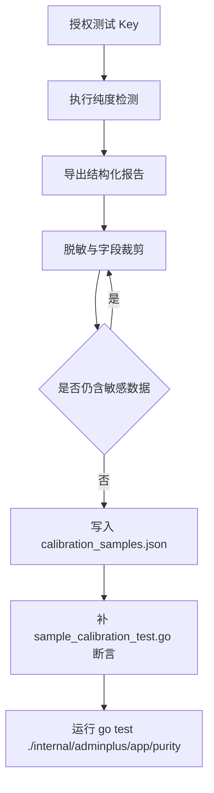

# API 纯度检测样本校准契约

版本：v0.1.0
日期：2026-06-28
状态：契约已定义；真实授权样本待按此格式持续补充。

配套采集流程见 [授权样本采集 Runbook](AUTHORIZED_SAMPLE_RUNBOOK.md)。

## 1. 背景

纯度检测规则会持续吸收 OpenAI、Claude、Gemini、国产模型兼容接口、透明中转和混淆型包装的真实表现。仅靠源码指纹或人工推断容易产生两个问题：

- 误伤透明中转：CLIProxyAPI、new-api、sub2api 等程序在不混淆模型、协议、usage/cache 和签名时可以是正常供应商形态，不能仅凭程序名降级。
- 漏掉混淆行为：模型 alias、低版本冒充高版本、跨厂商协议桥接、usage/cache 改写、SSE model 回写等行为可能只在真实请求样本里出现。

因此需要建立一套可回放、可脱敏、可审计的样本契约，用于校准 detector、评分封顶、模型身份一致性和前端报告解释。

## 2. 目标

- 使用授权样本校准官方 API、兼容 API、透明中转和混淆型包装的判定边界。
- 保证新增渠道 detector 时可以用样本回归验证“不误判、不漏判”。
- 让样本只包含必要指纹，不包含 API Key、账号、余额、完整请求体、完整响应体或可还原用户数据。
- 明确哪些证据来自接口返回、SSE 返回、错误体、模型列表、响应头或 token audit。

## 3. 非目标

- 不保存未授权平台的原始响应。
- 不保存生产用户的完整 prompt、completion、图片内容、密钥、账号、邮箱、余额和账单明细。
- 不把 Base URL 是否官方作为单独扣分样本；Base URL 只记录 host 级链路信息。
- 不把透明中转程序本身标记为恶意样本；只有混淆证据进入风险样本。

## 4. 样本分层

| 层级 | 用途 | 是否可入仓 |
|------|------|------------|
| 公开脱敏回归样本 | detector、模型身份、评分规则单测 | 可以 |
| 授权供应商脱敏样本 | 校准官方/兼容/中转表现 | 可以，必须脱敏 |
| 授权原始采集包 | 临时排查，包含更完整响应 | 不入仓，只能本地短期保存 |
| 密钥和账号材料 | 发起采样所需凭据 | 不入仓，不写入文档 |

## 5. 采样来源要求

每条真实样本必须满足：

- `source_authorized=true`，且采样人员确认拥有测试权限。
- 使用测试专用 API Key 或一次性低权限 Key。
- 记录绝对采样时间 `sampled_at`，格式为 RFC3339。
- 记录 provider、协议路径、目标模型、响应模型、是否流式、是否执行 token audit。
- 原始敏感字段在写入样本前完成脱敏。

## 6. 脱敏规则

| 字段 | 处理方式 |
|------|----------|
| API Key / Authorization / x-api-key / x-goog-api-key | 删除或替换为 `[REDACTED_KEY]` |
| Cookie / session / account id / org id | 删除或替换为 `[REDACTED_ACCOUNT]` |
| 完整 prompt / completion | 不保存，只保存长度、hash 或结构摘要 |
| 图片、文件、base64 | 不保存，只保存 mime、字节长度、hash |
| 错误体 | 保留错误 code/type/status；message 只保留去密钥、去账号后的短片段 |
| 响应头 | 只保留 detector 需要的白名单字段；其他字段丢弃 |
| Base URL | 只保留 host、scheme、路径类别；不保存带 token 的 query |

## 7. 样本字段契约

```json
{
  "sample_id": "authorized-openai-official-2026-06-28-001",
  "sample_kind": "authorized_redacted",
  "source_authorized": true,
  "sampled_at": "2026-06-28T00:00:00+08:00",
  "provider": "openai",
  "api_base_host": "api.openai.com",
  "protocol": "responses",
  "endpoint_family": "/v1/responses",
  "streaming": true,
  "model_id": "gpt-5.5",
  "expected_model": "gpt-5.5",
  "response_model": "gpt-5.5",
  "headers_redacted": {
    "content-type": "text/event-stream"
  },
  "body_fingerprints": {
    "json_schema": ["id", "object", "model", "output", "usage"],
    "sse_events": ["response.created", "response.output_text.delta", "response.completed"],
    "error_codes": [],
    "model_list_contains_requested": true
  },
  "token_audit_summary": {
    "executed": true,
    "sample_count": 11,
    "cache_hit_rate": 0.82,
    "multiplier": 1.03,
    "anomalies": []
  },
  "expected_signals": [],
  "expected_model_identity": {
    "status": "pass",
    "reason": "exact_match"
  },
  "expected_scores": {
    "official_score_min": 90,
    "compatibility_score_min": 90,
    "verdict": "official_openai"
  },
  "redaction_notes": "Only header whitelist and structural fingerprints are retained."
}
```

字段说明：

- `sample_kind=synthetic`：人工构造的回归样本，不来自真实供应商响应。
- `sample_kind=authorized_redacted`：来自授权供应商或官方 API 的真实脱敏样本，必须设置 `source_authorized=true` 和 `sampled_at`。
- `sample_id` 必须稳定、唯一、可读，使用 kebab-case。
- 真实授权样本入库前必须按 [授权样本采集 Runbook](AUTHORIZED_SAMPLE_RUNBOOK.md) 完成脱敏裁剪。

### 7.1 Token audit 回归样本

`calibration_samples.json` 额外支持 `token_audit_cases`，用于校准 usage/cache/state chain 和失败诊断，不保存原始 prompt、completion 或完整响应体。

```json
{
  "sample_id": "synthetic-openai-token-audit-failure-reason-001",
  "sample_kind": "synthetic",
  "name": "openai_token_audit_failure_reason_visible",
  "provider": "openai",
  "model_id": "gpt-5.5",
  "samples": [
    {
      "round": 1,
      "status": "fail",
      "status_code": 400,
      "error_class": "request_error",
      "error_message": "unsupported parameter: prompt_cache_key"
    }
  ],
  "want_status": "fail",
  "want_summary_contains": "第 1 轮 HTTP 400 unsupported parameter",
  "want_anomalies": ["usage_missing"],
  "want_usable_samples": 0,
  "want_missing_samples": 1
}
```

Token audit 样本约束：

- `error_message` 必须脱敏，不得包含 API Key、Bearer token、账号、邮箱或完整上游响应体。
- fallback 场景必须区分“拿到 usage 但状态链/缓存不完整”和“完全没有 usage”。
- 失败样本必须能证明前端可展示失败原因，即至少有 `status_code`、`error_class`、`error_message` 之一。
- 0 usage 样本不进入图表/表格，但必须计入 `want_missing_samples`。

## 8. 证据来源标记

样本中的每个 detector 信号应尽量标记来源，便于判断“接口返回还是 SSE 返回”：

| 来源 | 标记 | 示例 |
|------|------|------|
| 普通 JSON 响应 | `json_body` | `response_model`、`usage.input_tokens` |
| SSE 事件 | `sse_event` | `event`、`data.model`、`response.completed` |
| HTTP header | `header` | `x-cpa-version`、`x-new-api-version`、`x-client-request-id` |
| 错误体 | `error_body` | `API_KEY_REQUIRED`、`requested_model`、`upstream_model` |
| 模型列表 | `model_list` | `display_name`、fallback model ids |
| Token audit | `token_audit` | multiplier、cache hit、state chain |
| 路由组合 | `route_probe` | `/v1/messages` 与 `/v1/responses` 同时存在 |

如果某个源码能力无法通过上述来源观察到，样本不能直接把它作为混淆结论，只能记录为 `not_observable`。

## 9. 期望信号命名

`expected_signals` 使用稳定的 kebab-case 名称：

- 透明中转：`cliproxyapi`、`new-api`、`sub2api`、`openrouter`、`openai-compatible`。
- 混淆风险：`cliproxyapi-model-mapping`、`cliproxyapi-codex-identity`、`cliproxyapi-signature-bridge`、`sub2api-model-mapping`、`sub2api-protocol-bridge`、`new-api-model-mapping`。
- 国产兼容：`qwen-compatible`、`glm-compatible`、`doubao-compatible`、`minimax-compatible`、`hunyuan-compatible`、`kimi-compatible`、`mimo-compatible`、`deepseek-compatible`。
- 模型身份：`model-version-downgrade`、`model-tier-downgrade`、`cross-vendor-alias`、`protocol-vendor-mismatch`。

透明中转信号本身不要求降低 `official_score`；混淆风险和模型身份失败才参与评分封顶。

## 10. 写入流程



## 11. 验收标准

- 样本文件不包含 `sk-`、`Bearer `、`x-api-key` 原值、Cookie、session、邮箱、账号 ID、完整 prompt 或完整 completion。
- 每个新增 detector 至少有一个正样本和一个不应命中的负样本。
- 每个混淆风险样本必须说明证据来源，不能只引用源码字段。
- 每个透明中转样本必须验证“不因程序名或 Base URL 单独降级”。
- 每个模型身份样本必须断言 `expected_model`、`response_model`、`expected_model_identity.status/reason`。
- Token audit 样本必须断言 `want_status`、`want_summary_contains`、`want_anomalies`、可展示样本数和缺失样本数。
