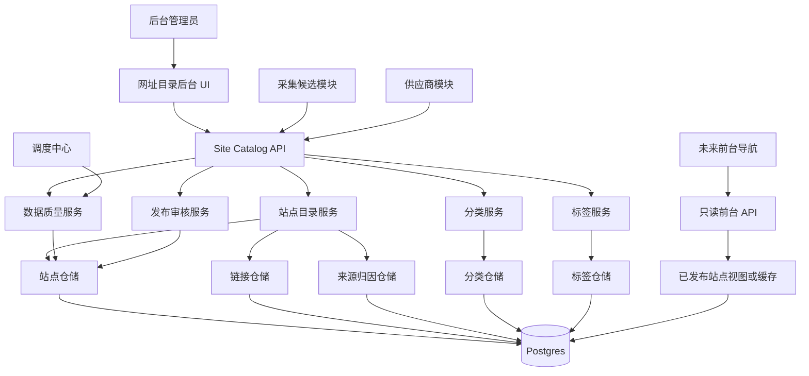
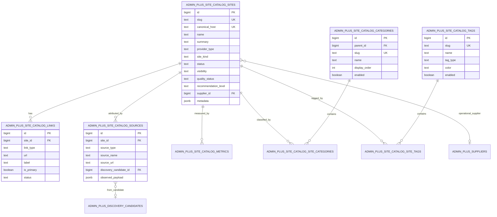
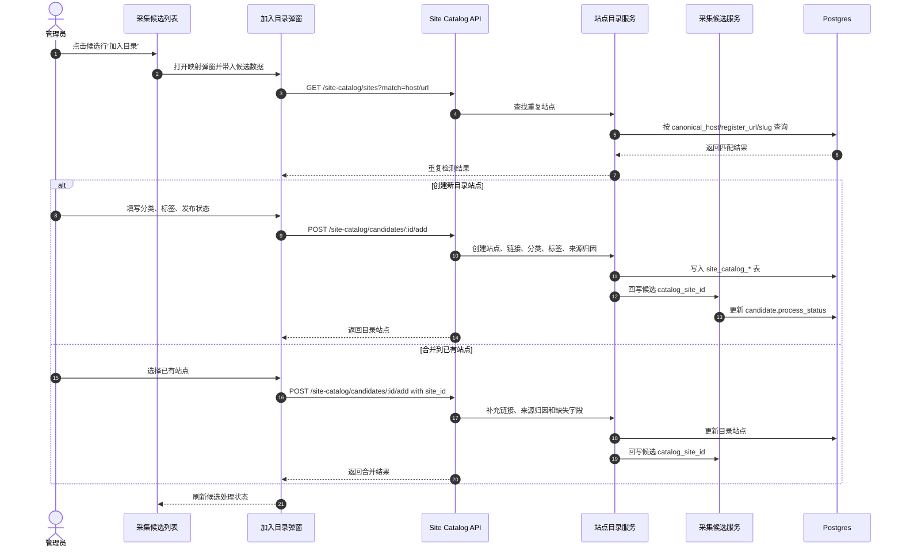
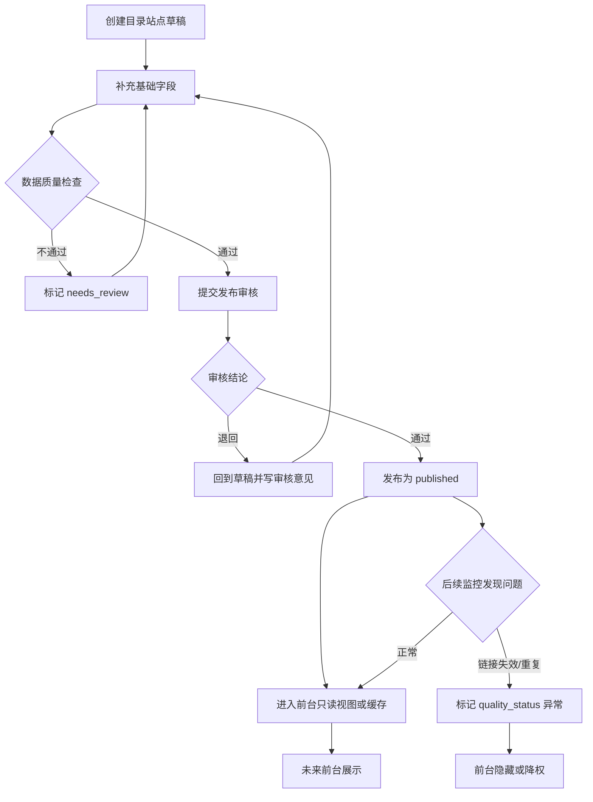
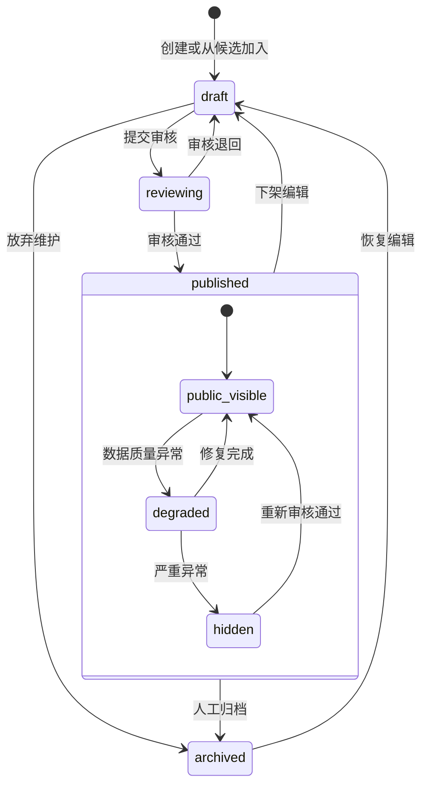
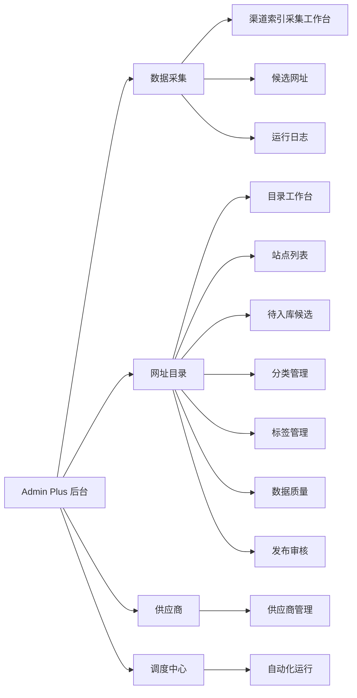

# 网址导航站点目录 PRD

版本：v0.1.0
日期：2026-06-24
状态：方案设计
范围：未来前台网址导航的数据基础、独立后台管理栏目、站点目录主数据、分类标签、链接、来源归因、发布状态，以及从采集候选加入目录的流程。前台网站本阶段不实现。

## 1. 背景

未来需要建设一个类似 `daheiai` 的前台网址导航站，但数据会比源站更丰富：站点类型、模型能力、价格/倍率、稳定性、注册状态、充值入口、监控、推荐理由、标签、来源、人工备注等。

这意味着不能直接把采集结果表当成前台导航主表。采集数据是“观察事实”，目录数据是“运营后的主数据”。两者需要解耦：

- 采集模块负责发现候选、保存来源痕迹和自动识别。
- site 模块负责沉淀可发布、可编辑、可分类、可展示的站点目录。
- 供应商模块负责运营侧接入、余额、倍率、渠道、账号和调度。

## 2. 设计结论

1. 建立独立后台栏目“网址目录”或“站点目录”。
2. 建立独立目录主表，不复用采集候选表作为前台事实源。
3. 一个目录站点可以关联多个采集来源和一个或多个供应商运营记录。
4. 目录站点默认草稿，人工审核后才可发布到未来前台。
5. 采集候选列表提供“加入目录”按钮，打开映射确认弹窗。
6. 目录模型必须支持分类、标签、多链接、来源归因、发布状态和数据质量状态。
7. 前台先不做，但后台数据模型要能直接支撑未来前台查询。

## 3. 领域边界

| 模块 | 主对象 | 负责内容 | 不负责内容 |
|------|--------|----------|------------|
| 采集 `caiji` | 候选网址 | 来源解析、重复识别、接口探测、运行日志 | 前台发布、人工推荐文案 |
| 网址目录 `site` | 目录站点 | 分类、标签、展示字段、链接、发布状态 | 自动注册、供应商余额 |
| 供应商 `suppliers` | 供应商运营实体 | 登录会话、分组、倍率、余额、渠道检测 | 前台目录排版 |
| 调度中心 `scheduler` | 自动化任务 | 周期运行、失败重试、审计 | 站点内容编辑 |

核心原则：

- 候选是输入，不是主数据。
- 目录站点是未来前台的事实源。
- 供应商是运营系统实体，不等于前台站点。

## 4. 后台信息架构

建议新增独立后台栏目：

```text
网址目录
  工作台
  站点列表
  待入库候选
  分类管理
  标签管理
  数据质量
  发布审核
  设置
```

页面职责：

| 页面 | 职责 |
|------|------|
| 工作台 | 展示目录站点总数、待审核、待补充、已发布、异常链接 |
| 站点列表 | 管理目录主数据，编辑标题、摘要、状态、分类、标签和链接 |
| 待入库候选 | 聚合采集候选，可快速加入目录 |
| 分类管理 | 管理前台导航分类树和排序 |
| 标签管理 | 管理能力标签、价格标签、风险标签 |
| 数据质量 | 找出缺分类、缺摘要、链接失效、重复站点 |
| 发布审核 | 草稿、待审核、已发布、已归档的审核流 |
| 设置 | 默认发布策略、slug 规则、重复检测策略 |

建议路由：

| 页面 | 路由 |
|------|------|
| 工作台 | `/admin/site-catalog` |
| 站点列表 | `/admin/site-catalog/sites` |
| 待入库候选 | `/admin/site-catalog/candidates` |
| 分类管理 | `/admin/site-catalog/categories` |
| 标签管理 | `/admin/site-catalog/tags` |
| 数据质量 | `/admin/site-catalog/quality` |
| 发布审核 | `/admin/site-catalog/review` |
| 设置 | `/admin/site-catalog/settings` |

## 5. 核心流程

### 5.1 从采集候选加入目录

```text
采集候选列表
  -> 点击“加入目录”
  -> 打开映射弹窗
  -> 自动带入名称、描述、注册 URL、host、provider_type、监控数据
  -> 管理员选择分类、标签、发布状态
  -> 系统检测是否已有相同 canonical_host / slug / register_url
  -> 创建或合并目录站点
  -> 写入来源归因记录
  -> 回写 candidate.catalog_site_id
  -> candidate.process_status = added_to_catalog
```

### 5.2 目录站点转供应商

```text
目录站点
  -> 点击“导入供应商”
  -> 选择供应商类型 new-api/sub2api
  -> 创建 admin_plus_suppliers
  -> 回写 site.supplier_id 或建立关联表
  -> 后续由供应商模块采集余额、倍率、渠道和充值数据
```

### 5.3 未来前台发布

```text
目录站点草稿
  -> 数据质量检查通过
  -> 人工审核
  -> 状态改为 published
  -> 前台只读取 published 且 visibility=public 的站点
```

## 6. 数据模型建议

表名前缀建议使用 `admin_plus_site_catalog_*`，避免和采集 `discovery`、供应商 `suppliers` 混淆。

### 6.1 目录站点

`admin_plus_site_catalog_sites`

| 字段 | 类型 | 说明 |
|------|------|------|
| `id` | BIGSERIAL | 主键 |
| `slug` | TEXT | 前台 URL 标识，唯一 |
| `canonical_host` | TEXT | 规范化主域名，去重主键之一 |
| `name` | TEXT | 展示名称 |
| `short_name` | TEXT | 短名称 |
| `summary` | TEXT | 一句话摘要 |
| `description` | TEXT | 详细描述 |
| `provider_type` | TEXT | `new_api`、`sub2api`、空 |
| `site_kind` | TEXT | `api_relay`、`official`、`tool`、`client`、`benchmark` |
| `status` | TEXT | `draft`、`reviewing`、`published`、`archived` |
| `visibility` | TEXT | `public`、`private` |
| `quality_status` | TEXT | `complete`、`needs_review`、`link_broken`、`duplicate` |
| `recommendation_level` | TEXT | `none`、`normal`、`featured`、`avoid` |
| `recommendation_reason` | TEXT | 推荐或避坑说明 |
| `risk_level` | TEXT | `unknown`、`low`、`medium`、`high` |
| `logo_url` | TEXT | logo |
| `screenshot_url` | TEXT | 截图 |
| `primary_language` | TEXT | 语言 |
| `country_or_region` | TEXT | 地区 |
| `supplier_id` | BIGINT | 可选关联供应商 |
| `metadata` | JSONB | 扩展能力、模型支持等 |
| `published_at` | TIMESTAMPTZ | 发布时间 |
| `created_at` | TIMESTAMPTZ | 创建时间 |
| `updated_at` | TIMESTAMPTZ | 更新时间 |

唯一约束：

- `UNIQUE (slug)`
- `UNIQUE (canonical_host) WHERE canonical_host <> ''`

说明：

- `metadata` 用于承载尚未稳定的前台字段，避免过早创建大量列。
- 稳定且需要筛选排序的字段应提升为显式列。

### 6.2 目录链接

`admin_plus_site_catalog_links`

| 字段 | 类型 | 说明 |
|------|------|------|
| `id` | BIGSERIAL | 主键 |
| `site_id` | BIGINT | 目录站点 ID |
| `link_type` | TEXT | `homepage`、`register`、`dashboard`、`api_base`、`recharge`、`docs`、`contact` |
| `url` | TEXT | URL |
| `label` | TEXT | 展示名称 |
| `is_primary` | BOOLEAN | 是否主链接 |
| `status` | TEXT | `unknown`、`ok`、`broken` |
| `last_checked_at` | TIMESTAMPTZ | 最近检查 |
| `created_at` | TIMESTAMPTZ | 创建时间 |
| `updated_at` | TIMESTAMPTZ | 更新时间 |

唯一约束：

- `UNIQUE (site_id, link_type, url)`

### 6.3 分类

`admin_plus_site_catalog_categories`

| 字段 | 类型 | 说明 |
|------|------|------|
| `id` | BIGSERIAL | 主键 |
| `parent_id` | BIGINT | 父分类 |
| `slug` | TEXT | 唯一标识 |
| `name` | TEXT | 名称 |
| `description` | TEXT | 说明 |
| `display_order` | INTEGER | 排序 |
| `enabled` | BOOLEAN | 是否启用 |
| `created_at` | TIMESTAMPTZ | 创建时间 |
| `updated_at` | TIMESTAMPTZ | 更新时间 |

`admin_plus_site_catalog_site_categories`

| 字段 | 类型 | 说明 |
|------|------|------|
| `site_id` | BIGINT | 站点 ID |
| `category_id` | BIGINT | 分类 ID |
| `is_primary` | BOOLEAN | 主分类 |
| `display_order` | INTEGER | 分类内排序 |

默认分类建议：

- 第三方中转
- 官方平台
- 开源工具
- 客户端
- 评测平台
- 其他

### 6.4 标签

`admin_plus_site_catalog_tags`

| 字段 | 类型 | 说明 |
|------|------|------|
| `id` | BIGSERIAL | 主键 |
| `slug` | TEXT | 唯一标识 |
| `name` | TEXT | 名称 |
| `tag_type` | TEXT | `capability`、`pricing`、`risk`、`model`、`region` |
| `color` | TEXT | 前台颜色 |
| `enabled` | BOOLEAN | 是否启用 |
| `created_at` | TIMESTAMPTZ | 创建时间 |
| `updated_at` | TIMESTAMPTZ | 更新时间 |

`admin_plus_site_catalog_site_tags`

| 字段 | 类型 | 说明 |
|------|------|------|
| `site_id` | BIGINT | 站点 ID |
| `tag_id` | BIGINT | 标签 ID |

标签示例：

- `Claude`
- `OpenAI`
- `Gemini`
- `便宜`
- `稳定`
- `需人工验证`
- `支持充值`
- `不推荐大额充值`

### 6.5 来源归因

`admin_plus_site_catalog_sources`

| 字段 | 类型 | 说明 |
|------|------|------|
| `id` | BIGSERIAL | 主键 |
| `site_id` | BIGINT | 目录站点 ID |
| `source_type` | TEXT | `discovery_candidate`、`manual`、`supplier`、`external` |
| `source_name` | TEXT | 来源名称 |
| `source_url` | TEXT | 来源入口 |
| `source_external_id` | TEXT | 外部站点 ID |
| `discovery_candidate_id` | BIGINT | 候选 ID |
| `observed_payload` | JSONB | 加入目录时的候选快照 |
| `first_seen_at` | TIMESTAMPTZ | 首次看到 |
| `last_seen_at` | TIMESTAMPTZ | 最近看到 |
| `created_at` | TIMESTAMPTZ | 创建时间 |

作用：

- 前台不用直接展示来源，但后台排障需要知道这个站点来自哪里。
- 后续多源采集时，同一站点可以关联多个来源。

### 6.6 指标快照

`admin_plus_site_catalog_metrics`

| 字段 | 类型 | 说明 |
|------|------|------|
| `id` | BIGSERIAL | 主键 |
| `site_id` | BIGINT | 目录站点 ID |
| `metric_type` | TEXT | `monitor`、`rate`、`vote`、`quality` |
| `metric_key` | TEXT | 指标名 |
| `metric_value` | DOUBLE PRECISION | 数值 |
| `value_text` | TEXT | 文本值 |
| `payload` | JSONB | 原始指标 |
| `captured_at` | TIMESTAMPTZ | 采集时间 |
| `created_at` | TIMESTAMPTZ | 创建时间 |

说明：

- 运营稳定字段仍然可以冗余到 `sites` 主表。
- 历史趋势和不稳定指标进入 metrics 表。

## 7. 与现有表关系

```text
admin_plus_discovery_candidates
  catalog_site_id -> admin_plus_site_catalog_sites.id

admin_plus_site_catalog_sites
  supplier_id -> admin_plus_suppliers.id

admin_plus_site_catalog_sources
  discovery_candidate_id -> admin_plus_discovery_candidates.id
```

关系说明：

- 候选加入目录后，不删除候选。
- 目录站点可以没有供应商。
- 供应商可以没有目录站点，例如内部测试供应商。
- 一个目录站点未来可以扩展多供应商关系，但 v1 先保留 `supplier_id` 单关联，避免过度设计。

## 8. API 设计

| 方法 | 路径 | 说明 |
|------|------|------|
| `GET` | `/api/v1/admin-plus/site-catalog/sites` | 站点列表 |
| `POST` | `/api/v1/admin-plus/site-catalog/sites` | 新建站点 |
| `GET` | `/api/v1/admin-plus/site-catalog/sites/:id` | 站点详情 |
| `PUT` | `/api/v1/admin-plus/site-catalog/sites/:id` | 更新站点 |
| `PATCH` | `/api/v1/admin-plus/site-catalog/sites/:id/status` | 更新发布状态 |
| `POST` | `/api/v1/admin-plus/site-catalog/sites/:id/import-supplier` | 导入供应商 |
| `GET` | `/api/v1/admin-plus/site-catalog/categories` | 分类列表 |
| `POST` | `/api/v1/admin-plus/site-catalog/categories` | 新建分类 |
| `PUT` | `/api/v1/admin-plus/site-catalog/categories/:id` | 更新分类 |
| `GET` | `/api/v1/admin-plus/site-catalog/tags` | 标签列表 |
| `POST` | `/api/v1/admin-plus/site-catalog/tags` | 新建标签 |
| `PUT` | `/api/v1/admin-plus/site-catalog/tags/:id` | 更新标签 |
| `GET` | `/api/v1/admin-plus/site-catalog/candidates` | 可加入目录的候选 |
| `POST` | `/api/v1/admin-plus/site-catalog/candidates/:id/add` | 候选加入目录 |
| `GET` | `/api/v1/admin-plus/site-catalog/quality/issues` | 数据质量问题 |

未来前台 API 另行设计，只读 published 数据，不复用后台写接口。

## 9. 加入目录弹窗

从采集候选点击“加入目录”时，弹窗字段：

| 字段 | 默认值 | 必填 |
|------|--------|------|
| 站点名称 | candidate.name | 是 |
| slug | 根据 host/name 自动生成 | 是 |
| 主域名 | candidate.host | 是 |
| 摘要 | candidate.description 前 120 字 | 否 |
| 详细描述 | candidate.description | 否 |
| 站点类型 | `api_relay` | 是 |
| 系统类型 | candidate.provider_type | 否 |
| 分类 | 第三方中转 | 是 |
| 标签 | 根据描述和类型自动建议 | 否 |
| 注册链接 | candidate.register_url | 否 |
| 仪表盘链接 | candidate.dashboard_url | 否 |
| API Base | candidate.api_base_url | 否 |
| 发布状态 | draft | 是 |
| 推荐级别 | none | 是 |

弹窗底部动作：

- 创建目录站点
- 合并到已有站点
- 保存草稿
- 取消

重复检测：

- `canonical_host` 相同。
- `register_url` 相同。
- `slug` 相同。
- host 去掉 `www.` 后相同。

## 10. 数据质量规则

目录站点需要定期检查：

- 缺少分类。
- 缺少主链接。
- slug 重复或不规范。
- canonical host 重复。
- 已发布但没有摘要。
- 链接状态为 broken。
- provider_type 为 unknown 但已标记为可注册。
- 推荐级别为 featured 但缺少推荐理由。
- 关联供应商已禁用或会话失效。

数据质量页面应支持：

- 按问题类型筛选。
- 批量修复分类/标签。
- 跳转站点编辑。
- 标记忽略。

## 11. 发布策略

发布状态：

| 状态 | 说明 |
|------|------|
| `draft` | 草稿，默认状态 |
| `reviewing` | 待审核 |
| `published` | 可被未来前台读取 |
| `archived` | 归档，不再展示 |

前台读取条件：

```text
status = 'published'
AND visibility = 'public'
AND quality_status NOT IN ('duplicate', 'link_broken')
```

## 12. 分阶段实施

### Phase 1：目录模型和后台入口

- 新增 site catalog 数据表。
- 新增后台导航“网址目录”。
- 实现站点列表、分类、标签基础 CRUD。
- 实现采集候选加入目录。

### Phase 2：数据质量和审核

- 新增数据质量检查。
- 新增发布审核流。
- 支持候选合并到已有站点。
- 支持目录站点导入供应商。

### Phase 3：运营增强

- 展示监控、倍率、充值入口、供应商状态。
- 支持推荐级别和推荐理由。
- 支持批量分类、批量标签。
- 支持站点截图、logo 和富文本描述。

### Phase 4：前台准备

- 设计只读前台 API。
- 建立发布缓存或物化视图。
- 支持分类页、标签页、站点详情页需要的数据查询。
- 前台网站另开实施文档。

## 13. 验收标准

- 后台有独立“网址目录”栏目。
- 采集候选可以点击加入目录。
- 目录站点与采集候选保留关联关系。
- 目录站点支持分类、标签、多个链接和发布状态。
- 目录站点不是采集表的直接展示。
- 已发布数据具备未来前台读取条件。
- 数据质量页面能识别基础问题。

## 14. 架构与流程图

### 14.1 网址目录系统架构图



设计要点：

- 后台 `Site Catalog API` 负责写入和审核。
- 未来前台只读 `published` 数据，不能复用后台写接口。
- 采集候选、供应商和调度中心都只能通过明确 API 与站点目录交互。

### 14.2 目录数据关系图



### 14.3 候选加入目录时序图



### 14.4 目录站点发布流程图



### 14.5 目录站点状态机



### 14.6 后台栏目导航结构图


